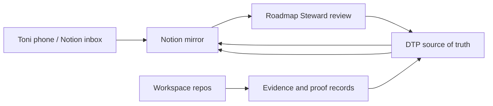

# Notion Mirror And Command Center

Status: active mirror contract plus V1 cockpit improvement lane. This is not a source-of-truth move.

Owner: `diagnose-to-plan`

Purpose: make the consulting operating system available from Toni's phone without moving the real operating brain out of DTP.

## Why This Exists

Toni needs a mobile-friendly surface for ideas, roadmap review, daily planning, and lightweight project visibility. Notion is a strong fit for that human layer because it is easy to read, filter, and update from a phone.

DTP remains the source of truth for:

- roadmap and Kanban execution
- repo ownership and gates
- steward receipts
- proof/redaction governance
- private engagement kits
- repo manifests and evidence indexes
- hosted DTP and FAOS readiness decisions

Notion becomes:

- a daily cockpit
- a mobile idea inbox
- a readable roadmap mirror
- a lightweight project-health view
- a meeting-notes and action-item capture surface

## Core Rule

Mirror the work. Do not relocate the work.

If Notion and DTP disagree, DTP wins until a steward review intentionally updates DTP.

## V1 Command Center Upgrade

V1 improves the existing `DTP Practice OS Command Center` in place. Do not
create a parallel command center unless the live page is broken or duplicated
beyond repair.

The first screen should answer one question: what needs Toni's attention now?

Use these top-level sections:

- `Today`
- `This Week`
- `Waiting On`
- `Decision Needed`
- `Client Lanes`
- `Proof Queue`
- `Roadmap`
- `Idea Inbox`
- `Repo Health`
- `Meetings`
- `Archive`

Use `practice-os/templates/notion-cockpit-audit.md` before and after a live
cockpit rebuild. The audit should check current Notion shape against DTP source
paths, stale records, duplicate state, unsafe fields, unclear page names, and
Toni correction notes.

V1 is allowed to:

- tighten dashboard layout and section order;
- add linked database views to the existing command center;
- add missing safe fields to existing databases;
- create sanitized seed rows from DTP steward receipts;
- add plain-language templates for common operating inputs.

V1 is not allowed to:

- move private engagement truth into Notion;
- add two-way sync;
- publish proof;
- store raw client replies, private contact details, transcripts, payment data,
  secrets, or unsupported public claims;
- create a second command center unless the steward receipt explains why.

## V0 Surfaces

Create these Notion areas manually first. Automation can come later.

| Notion Surface | Mirrors From | Purpose |
|---|---|---|
| Practice Home | roadmap, backlog, active queue | one-page daily cockpit |
| Roadmap / Kanban | `docs/ROADMAP_EXECUTION_BACKLOG.md` | phone-friendly epic/story tracking |
| Idea Inbox | Toni mobile notes, chat follow-ups | capture rough ideas before classification |
| Repo Health | `practice-os/efficiency/*-repo-manifest.md` and `*-evidence-index.md` | see which repo is healthy, blocked, or next |
| Client / Pilot Snapshots | redacted summaries from DTP engagement kits | track pilots without exposing raw private material |
| Proof Queue | proof/redaction templates and packets | see which proof candidates are blocked or ready |
| Research Radar | `practice-os/templates/research-radar-item.md` | track Adopt, Pilot, Watch, Reject items |
| Decision Log | decision records and steward receipts | preserve why a path was chosen |
| Meeting Notes | sanitized meeting summaries | convert conversations into action items |

## Suggested Databases

### 1. Ideas

Properties:

- `Name`
- `Captured At`
- `Source`: phone, Codex, meeting, repo work, research, client
- `Classification`: inbox, story, template, eval, proof item, research item, decision, repo touch pass, parked
- `Owning Repo`
- `Status`: inbox, triage, accepted, parked, done
- `DTP Link`
- `Next Action`
- `Sensitivity`: public-safe, internal-only, private-client, COI-gated

Rule: phone ideas start as `inbox`. A steward review promotes them into DTP artifacts.

V1 presentation views:

- `Inbox`: untriaged phone/chat captures.
- `Triage`: ideas that need DTP classification.
- `Parked`: useful but inactive ideas.

### 2. Roadmap Stories

Properties:

- `Story`
- `Epic`
- `Repo`
- `Phase`
- `Status`
- `Done Gate`
- `Blocker`
- `Next Action`
- `DTP Source Path`
- `Last Mirrored At`

Rule: status changes should be made in DTP first, then mirrored to Notion.

V1 presentation views:

- `Active Next`: only stories that are active or ready.
- `By Phase`: grouped by roadmap phase.
- `Blocked`: stories waiting on a named gate.

### 3. Repo Health

Properties:

- `Repo`
- `Lane`
- `Manifest`
- `Evidence Index`
- `Last Verified`
- `Local Gates`
- `CI State`
- `Proof Risk`
- `Privacy / COI Risk`
- `Current Blocker`
- `Next Touch Trigger`

Rule: Notion shows the latest recorded evidence; it does not replace repo-local validation.

V1 presentation views:

- `Needs Touch`: repos with blockers or stale verification.
- `Healthy`: repos with current evidence and no active blocker.

### 4. Proof Queue

Properties:

- `Claim`
- `Source Repo`
- `Engagement`
- `Permission`
- `Redaction`
- `Reviewer`
- `Evidence`
- `Caveat`
- `Status`
- `Public-Safe Summary`

Rule: no raw private material, transcript, payment record, student/member data, secret, or unsupported claim goes into Notion.

V1 presentation views:

- `Proof Blocked`: missing permission, redaction, reviewer, evidence, or caveat.
- `Internal Only`: useful internal proof candidates that are not public-safe.

### 5. Research Radar

Properties:

- `Topic`
- `Source`
- `Classification`: Adopt, Pilot, Watch, Reject
- `Why It Matters`
- `Risk`
- `Repo / System Impact`
- `Review Date`
- `Next Action`

Rule: research does not become implementation until DTP has a story, gate, and owner repo.

## Sync Direction



Inbound:

- quick idea from phone
- meeting note
- client follow-up
- research link
- "remember to update X"

Outbound:

- active roadmap queue
- repo health summaries
- proof queue status
- blockers
- owner/client-safe action lists
- research radar status

## Data Boundaries

Allowed in Notion:

- public-safe roadmap summaries
- internal planning notes
- sanitized client/pilot summaries
- repo names, gates, blockers, and non-secret evidence status
- action items
- links to DTP paths or GitHub repos

Do not put in Notion without explicit review:

- secrets, tokens, API keys, credentials
- raw transcripts
- private emails
- form submissions
- payment records
- student/member data
- unapproved photos or screenshots
- raw logs with sensitive data
- DSE/Microsoft confidential material
- public proof claims without permission, evidence, reviewer, redaction, and caveat

## Implementation Ladder

V0: manual Notion mirror.

- Create the databases above.
- Use Notion from the phone for capture.
- Run Roadmap Steward review to promote good ideas back into DTP.

V0.5: Notion MCP assisted updates.

- Add Notion MCP to Codex user config.
- Authenticate with OAuth.
- Let Codex create/update Notion pages when explicitly asked.
- Keep DTP updates first for source-of-truth records.

V1: DTP export command.

- Add a read-only `dtp notion export` or `dtp mirror notion --dry-run`.
- Produce sanitized JSON/Markdown payloads from DTP-owned artifacts.
- Do not write to Notion until the dry run is reviewed.

V1.0: live cockpit ergonomics.

- Audit the existing Command Center with
  `practice-os/templates/notion-cockpit-audit.md`.
- Improve the existing page layout, linked views, database fields, and templates.
- Verify one sanitized DTP steward receipt can be mirrored into Notion and still
  points back to its DTP source.
- Record the result in a DTP steward receipt before treating the cockpit as
  current.

V2: Notion API/MCP sync.

- Update Notion from DTP records using stable IDs and redaction rules.
- Store sync metadata in an ignored local map or hosted DTP, not scattered through public docs.
- Keep Notion edits as capture inputs, not authoritative status changes.

V3: hosted DTP dashboard plus Notion companion.

- Hosted DTP becomes the private operational app.
- Notion remains the human-readable/mobile companion, not the database of record.

## Setup Notes

Official Notion MCP is available at:

- https://developers.notion.com/guides/mcp/overview
- https://developers.notion.com/docs/get-started-with-mcp

For Codex, Notion documents this user-level config:

```toml
[mcp_servers.notion]
url = "https://mcp.notion.com/mcp"
```

Then authenticate:

```powershell
codex mcp login notion
```

This requires a human OAuth login. Do not commit user-level auth, OAuth state, Notion tokens, or workspace IDs unless they are intentionally non-secret references.

## Current Setup Status

As of 2026-04-30:

- Codex user config includes the Notion MCP endpoint.
- `codex mcp login notion` completed successfully after Toni finished the OAuth browser flow.
- `codex mcp list` shows `notion` enabled with `OAuth`.
- A refreshed Codex session exposes authenticated Notion tools.
- The smoke page `DTP Notion MCP Smoke Test` was created and fetched successfully.
- V0 child databases were created under the smoke page: Ideas, Roadmap Stories, Repo Health, Proof Queue, Research Radar, Client Pilot Snapshots, Decision Log, and Meeting Notes.
- One safe seed row was added to each database to prove write access without mirroring raw private material.
- Phone-friendly views were added for inbox/triage, roadmap, repo health, proof, research, pilots, decisions, and notes.

As of 2026-05-01:

- The smoke-test page was promoted to `DTP Practice OS Command Center`.
- The command center is now the phone-friendly cockpit for active work, while DTP remains the source of truth.
- Active sanitized snapshots were added for Cam / SMB M&A Platform, Greg / TheGrantApp.io, Mom / CCAAP Site Rebuild, and the separated Omnexus app-ops lane.
- Sanitized meeting-note mirrors were added for the 2026-05-01 Cam and Greg meetings.
- Current roadmap-story mirrors were added for Notion cockpit use, Cam formalization/prototype work, Greg discovery/permission, and CCAAP owner-input closure.
- The activation receipt lives at `practice-os/steward/2026-05-01-notion-command-center-activation.md`.
- Automation remains parked behind a future DTP-owned dry run and redaction review.

As of 2026-05-02:

- The cockpit pattern is standardized around `Today`, `Waiting On`, `Decision Needed`, `Next Meeting`, and `Proof Blocked` views.
- Client snapshots use the cadence fields `next_meeting`, `waiting_on`, `next_action`, `blocked_by`, and `last_updated`.
- Client replies must be processed through `docs/CLIENT_REPLY_INTAKE_OPERATING_PATTERN.md` before Notion status changes.
- Broad infrastructure/client sessions should use `docs/PRACTICE_INTELLIGENCE_CONTROL_PLANE.md` before Notion is updated, so loose ideas, replies, tool requests, assistant ideas, finance/admin requests, and durable memory candidates land in the right DTP artifact first.
- Notion remains a sanitized cockpit; DTP remains the source of truth.
- Toni has upgraded Notion. Treat that as permission to improve cockpit ergonomics
  and search/review flows after live feature availability is verified; it does
  not change the rule that DTP owns source-of-truth state.

As of 2026-05-03:

- The existing `DTP Practice OS Command Center` was rebuilt in place for V1
  cockpit ergonomics; no parallel command center was created.
- The first screen is organized around `Today`, `This Week`, `Waiting On`,
  `Decision Needed`, `Client Lanes`, `Proof Queue`, `Roadmap`, `Idea Inbox`,
  `Repo Health`, `Meetings`, and `Archive`.
- Client Pilot Snapshots gained `Lane`, `DTP Source`, and `proof_status`.
- Roadmap Stories gained `Phase`.
- A sanitized decision-log mirror item was added from
  `practice-os/steward/2026-05-03-notion-command-center-v1.md`.
- The receipt lives at
  `practice-os/steward/2026-05-03-notion-command-center-v1.md`.
- After a live Cameron/Greg/CCAAP reply scan found no new actionable replies,
  quick-action starter pages were added for `Client Update`,
  `Decision Needed`, `Proof Candidate`, and `Weekly Reset`; the receipt lives at
  `practice-os/steward/2026-05-03-live-reply-scan-and-notion-quick-actions.md`.

Completed authenticated smoke test:

1. Confirm `codex mcp list` shows `notion` as `OAuth`.
2. Restart the Codex session if the Notion tools are not visible immediately.
3. Create a small test page named `DTP Notion MCP Smoke Test`.
4. Fetch the smoke page and confirm the intended workspace accepts reads/writes.
5. Create the V0 mirror databases, safe seed rows, and phone-friendly views.

Future automation should still start from a DTP-owned dry run and redaction review before any write-enabled Notion sync.

## Good Extra Ideas

- Add a pinned "Today" Notion view: active next queue, blockers, newest ideas, and CCAAP action items.
- Add a "Waiting On" view: Mom owner approvals, PayPal links, Cloudflare/DNS, Hub parked PRs, proof gates, external smoke tests.
- Add an "Idea Inbox triage Friday" routine: promote, park, or delete captured ideas weekly.
- Add a "Proof candidates" gallery with only public-safe thumbnails and gate status.
- Add a "Repo touch pass" board grouped by repo so the next clean batch is obvious from a phone.
- Add a "Research radar" database with review dates so interesting tools do not become random scope creep.
- Add a "Decision needed" view for choices like Cloudflare domain, contact routing, CMS timing, hosted DTP start, and FAOS readiness.
- Keep "Today", "Waiting On", "Decision Needed", "Next Meeting", and "Proof Blocked" visible as the daily cockpit shape for active work.

## Acceptance For V0

- Notion is documented as a mirror, not source of truth.
- DTP roadmap/backlog knows the Notion Mirror lane exists.
- Roadmap Steward reviews include a Notion inbox check once Notion is enabled.
- No private client data, secrets, DSE/Microsoft confidential material, or public proof claims are mirrored without gates.
- A future automation pass starts from this doc instead of guessing sync rules from chat.

## Acceptance For V1 Cockpit

- The existing Command Center is improved in place.
- The first screen answers what needs Toni's attention now.
- Client lanes expose `waiting_on`, `next_action`, `blocked_by`,
  `last_updated`, and proof status.
- Source databases remain reachable for traceability.
- DTP source paths are visible on mirrored operating items.
- A steward receipt records every live Notion rebuild.
