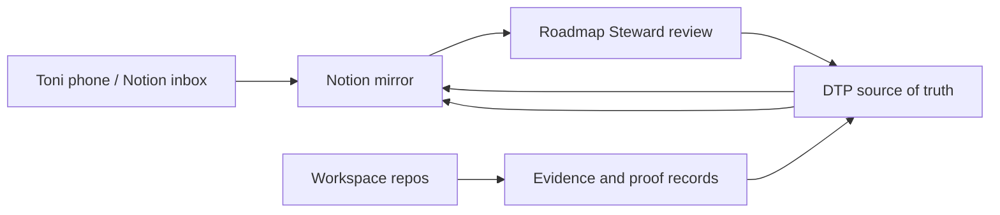

# Notion Mirror V0

Status: planning and setup contract. This is not a source-of-truth move.

Owner: `diagnose-to-plan`

Purpose: make the consulting operating system available from Toni's phone without moving the real operating brain out of DTP.

## Why This Exists

Toni needs a mobile-friendly surface for ideas, roadmap review, daily planning, and lightweight project visibility. Notion is a strong fit for that human layer because it is easy to read, filter, and update from a phone.

DTP remains the source of truth for:

- roadmap and Kanban execution
- repo ownership and gates
- steward receipts
- proof/redaction governance
- private engagement kits
- repo manifests and evidence indexes
- hosted DTP and FAOS readiness decisions

Notion becomes:

- a daily cockpit
- a mobile idea inbox
- a readable roadmap mirror
- a lightweight project-health view
- a meeting-notes and action-item capture surface

## Core Rule

Mirror the work. Do not relocate the work.

If Notion and DTP disagree, DTP wins until a steward review intentionally updates DTP.

## V0 Surfaces

Create these Notion areas manually first. Automation can come later.

| Notion Surface | Mirrors From | Purpose |
|---|---|---|
| Practice Home | roadmap, backlog, active queue | one-page daily cockpit |
| Roadmap / Kanban | `docs/ROADMAP_EXECUTION_BACKLOG.md` | phone-friendly epic/story tracking |
| Idea Inbox | Toni mobile notes, chat follow-ups | capture rough ideas before classification |
| Repo Health | `practice-os/efficiency/*-repo-manifest.md` and `*-evidence-index.md` | see which repo is healthy, blocked, or next |
| Client / Pilot Snapshots | redacted summaries from DTP engagement kits | track pilots without exposing raw private material |
| Proof Queue | proof/redaction templates and packets | see which proof candidates are blocked or ready |
| Research Radar | `practice-os/templates/research-radar-item.md` | track Adopt, Pilot, Watch, Reject items |
| Decision Log | decision records and steward receipts | preserve why a path was chosen |
| Meeting Notes | sanitized meeting summaries | convert conversations into action items |

## Suggested Databases

### 1. Ideas

Properties:

- `Name`
- `Captured At`
- `Source`: phone, Codex, meeting, repo work, research, client
- `Classification`: inbox, story, template, eval, proof item, research item, decision, repo touch pass, parked
- `Owning Repo`
- `Status`: inbox, triage, accepted, parked, done
- `DTP Link`
- `Next Action`
- `Sensitivity`: public-safe, internal-only, private-client, COI-gated

Rule: phone ideas start as `inbox`. A steward review promotes them into DTP artifacts.

### 2. Roadmap Stories

Properties:

- `Story`
- `Epic`
- `Repo`
- `Status`
- `Done Gate`
- `Blocker`
- `Next Action`
- `DTP Source Path`
- `Last Mirrored At`

Rule: status changes should be made in DTP first, then mirrored to Notion.

### 3. Repo Health

Properties:

- `Repo`
- `Lane`
- `Manifest`
- `Evidence Index`
- `Last Verified`
- `Local Gates`
- `CI State`
- `Proof Risk`
- `Privacy / COI Risk`
- `Current Blocker`
- `Next Touch Trigger`

Rule: Notion shows the latest recorded evidence; it does not replace repo-local validation.

### 4. Proof Queue

Properties:

- `Claim`
- `Source Repo`
- `Engagement`
- `Permission`
- `Redaction`
- `Reviewer`
- `Evidence`
- `Caveat`
- `Status`
- `Public-Safe Summary`

Rule: no raw private material, transcript, payment record, student/member data, secret, or unsupported claim goes into Notion.

### 5. Research Radar

Properties:

- `Topic`
- `Source`
- `Classification`: Adopt, Pilot, Watch, Reject
- `Why It Matters`
- `Risk`
- `Repo / System Impact`
- `Review Date`
- `Next Action`

Rule: research does not become implementation until DTP has a story, gate, and owner repo.

## Sync Direction



Inbound:

- quick idea from phone
- meeting note
- client follow-up
- research link
- "remember to update X"

Outbound:

- active roadmap queue
- repo health summaries
- proof queue status
- blockers
- owner/client-safe action lists
- research radar status

## Data Boundaries

Allowed in Notion:

- public-safe roadmap summaries
- internal planning notes
- sanitized client/pilot summaries
- repo names, gates, blockers, and non-secret evidence status
- action items
- links to DTP paths or GitHub repos

Do not put in Notion without explicit review:

- secrets, tokens, API keys, credentials
- raw transcripts
- private emails
- form submissions
- payment records
- student/member data
- unapproved photos or screenshots
- raw logs with sensitive data
- DSE/Microsoft confidential material
- public proof claims without permission, evidence, reviewer, redaction, and caveat

## Implementation Ladder

V0: manual Notion mirror.

- Create the databases above.
- Use Notion from the phone for capture.
- Run Roadmap Steward review to promote good ideas back into DTP.

V0.5: Notion MCP assisted updates.

- Add Notion MCP to Codex user config.
- Authenticate with OAuth.
- Let Codex create/update Notion pages when explicitly asked.
- Keep DTP updates first for source-of-truth records.

V1: DTP export command.

- Add a read-only `dtp notion export` or `dtp mirror notion --dry-run`.
- Produce sanitized JSON/Markdown payloads from DTP-owned artifacts.
- Do not write to Notion until the dry run is reviewed.

V2: Notion API/MCP sync.

- Update Notion from DTP records using stable IDs and redaction rules.
- Store sync metadata in an ignored local map or hosted DTP, not scattered through public docs.
- Keep Notion edits as capture inputs, not authoritative status changes.

V3: hosted DTP dashboard plus Notion companion.

- Hosted DTP becomes the private operational app.
- Notion remains the human-readable/mobile companion, not the database of record.

## Setup Notes

Official Notion MCP is available at:

- https://developers.notion.com/guides/mcp/overview
- https://developers.notion.com/docs/get-started-with-mcp

For Codex, Notion documents this user-level config:

```toml
[mcp_servers.notion]
url = "https://mcp.notion.com/mcp"
```

Then authenticate:

```powershell
codex mcp login notion
```

This requires a human OAuth login. Do not commit user-level auth, OAuth state, Notion tokens, or workspace IDs unless they are intentionally non-secret references.

## Good Extra Ideas

- Add a pinned "Today" Notion view: active next queue, blockers, newest ideas, and CCAAP action items.
- Add a "Waiting On" view: Mom owner approvals, PayPal links, Cloudflare/DNS, Hub parked PRs, proof gates, external smoke tests.
- Add an "Idea Inbox triage Friday" routine: promote, park, or delete captured ideas weekly.
- Add a "Proof candidates" gallery with only public-safe thumbnails and gate status.
- Add a "Repo touch pass" board grouped by repo so the next clean batch is obvious from a phone.
- Add a "Research radar" database with review dates so interesting tools do not become random scope creep.
- Add a "Decision needed" view for choices like Cloudflare domain, contact routing, CMS timing, hosted DTP start, and FAOS readiness.

## Acceptance For V0

- Notion is documented as a mirror, not source of truth.
- DTP roadmap/backlog knows the Notion Mirror lane exists.
- Roadmap Steward reviews include a Notion inbox check once Notion is enabled.
- No private client data, secrets, DSE/Microsoft confidential material, or public proof claims are mirrored without gates.
- A future automation pass starts from this doc instead of guessing sync rules from chat.
