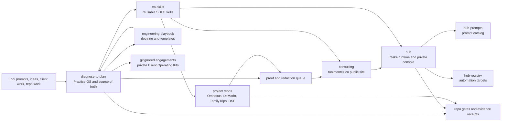
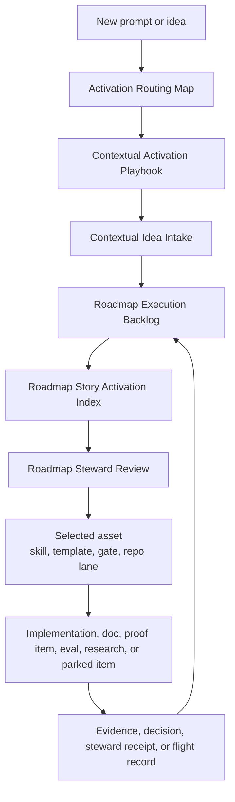
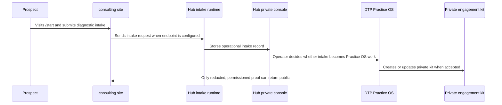
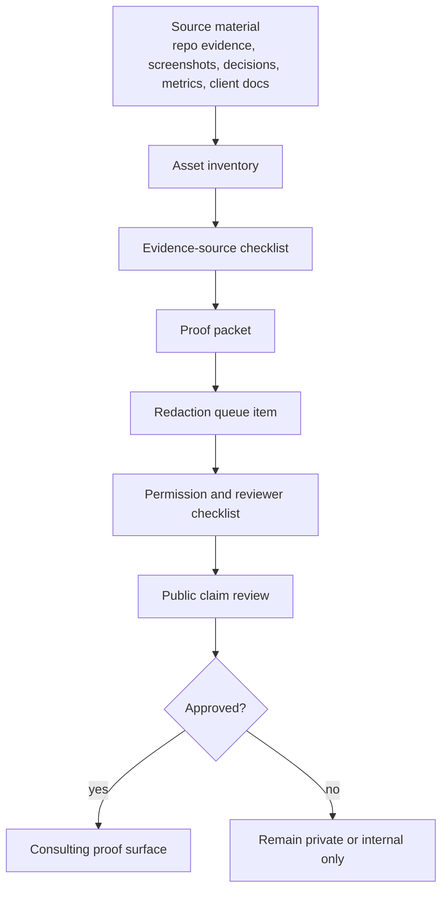
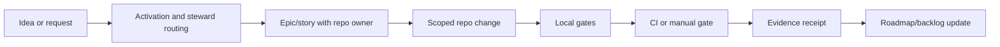
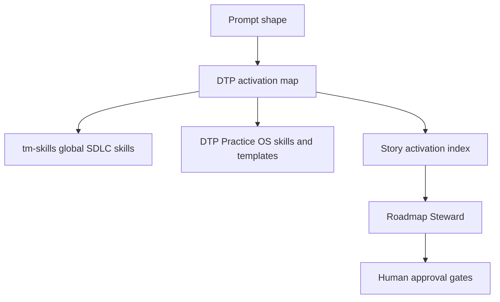

# Practice System Architecture

Status: current-state master architecture for Toni Montez consulting operations.

Owner: `diagnose-to-plan`

Purpose: describe what exists today, which repo owns what, how prompts turn into work, how evidence becomes proof, and which gates protect public proof, private engagement data, hosted DTP, global skills, and automation.

This document is the current-state companion to `docs/PRACTICE_SYSTEM_FUTURE_STATE.md`, `docs/PRACTICE_SYSTEM_AUDIT_AND_GAP_REVIEW.md`, and `docs/PRACTICE_SYSTEM_OPTIMIZATION_PLAN.md`.

## Operating Thesis

The consulting system is a multi-repo Practice OS, not a single app.

DTP is the private operating brain. Consulting is the public storefront and proof surface. Hub is the runtime intake and operator console layer. `tm-skills` is the reusable coding-agent skill layer. Project repos remain separate product/client tracks with their own gates, proof rules, and delivery context.

The current system is designed to reduce reliance on memory:

- Roadmap intent lives in DTP roadmap docs.
- Execution status lives in the Kanban backlog.
- Prompt routing lives in the activation map and contextual activation playbook.
- Story-to-skill routing lives in the story activation index.
- Private client work lives in ignored engagement kits or a future private vault.
- Public proof must pass evidence, redaction, permission, reviewer, and caveat gates.

## Current Repo Ownership Map

GitHub ownership boundary: as of 2026-04-30, the consulting/practice portfolio repos use the `Toni-Montez-Consulting` organization namespace. `dse-content` stays outside that organization in Toni's personal/Microsoft-linked namespace and remains COI-gated until explicitly selected with a clean, scoped pass.

| Repo | Current Role | Primary Gates | Boundary |
|---|---|---|---|
| `diagnose-to-plan` | Practice OS, roadmap, engagement kits, redaction, COI, templates, hosted DTP design, steward loop | `pytest`, `ruff`, `dtp skills --validate`, `dtp practice doctor`, redaction checks | Does not own public storefront or Hub runtime records |
| `consulting` | Public site, `/start`, proof surface, public-safe `/admin` command room | `npm run build`, secret scan, route/visual checks when expanded | Does not store private engagement kits |
| `hub` | Runtime intake, private console, Supabase operational records, prompts/runs/captures | `pnpm verify`, `pnpm test`, security workflows, health/intake checks | Does not become DTP, CRM, or public proof source |
| `tm-skills` | Reusable global SDLC skills and install/doctor scripts | `doctor.ps1`, `freshness-check.ps1`, `install.ps1 -WhatIf` | Global install remains explicit-approval only |
| `engineering-playbook` | General doctrine, portfolio templates, decisions, secret-management references | portfolio checks and repo-local scripts | Does not duplicate DTP roadmap ownership |
| `hub-prompts` | Hub prompt catalog, prompt schemas, validation fixtures | `npm test`, prompt validation | Does not own Hub runtime routing or DTP roadmap |
| `hub-registry` | Hub automation target registry and routing config | `npm run validate`, local portfolio manifest checks, local prompt-id cross-validation | Does not own prompt content or practice roadmap |
| `fitness-app` / Omnexus | Product app, verification cockpit reference, founder/product proof candidate | app local gates, toolkit registry, CI evidence, Supabase drift gates, DTP extraction receipts | Do not disturb app code without explicit lane |
| `demario-pickleball-1` | Local-business launch track and command-room reference | `npm run ci`, venue/routing/manual launch gates | Reference pattern, not practice roadmap owner |
| `FamilyTrips` | Private family trip app and privacy-first maintenance lane | data validation, build, tests, privacy checks | Not public proof by default |
| `dse-content` | Internal Azure Apps/AI content and Microsoft-adjacent proof candidate | branch-specific app gates, COI, permission, redaction | Internal/professional proof only unless explicitly cleared |

## Current Multi-Repo Architecture

## Prompt, Idea, And Story Activation Flow

Activation means routing, not autonomy. The map can suggest a skill, template, gate, repo lane, or agent role, but it does not authorize global installs, autonomous edits, public proof, hosted implementation, or write-enabled automation.

## Consulting Intake Flow

Current boundary:

- Consulting collects and presents. It does not own private engagement records.
- Hub receives and operates runtime records. It does not own DTP methodology or public proof.
- DTP diagnoses, plans, redacts, governs, and promotes only reviewed proof.

## Proof And Redaction Flow

Public proof is blocked unless the claim has:

- evidence source
- baseline or before-state
- after-state
- measurement caveat
- permission level
- redaction status
- reviewer status

## Development Workflow

Default order:

1. Identify the owning repo and no-touch boundaries.
2. Promote the idea into a backlog story only when it has a Done gate.
3. Use the relevant skill/template/gate from the activation map.
4. Run repo-local gates before claiming completion.
5. Capture evidence, decisions, or follow-ups in durable artifacts.
6. Update the roadmap/backlog if priority or status changed.

## Current Verification Spine

The current verification model is intentionally thin and repo-local:

| Lane | Current Shape |
|---|---|
| DTP | Python tests, ruff, skill validation, practice doctor, redaction checks |
| Consulting | build, secret scan, route checks when browser setup is intentionally expanded |
| Hub | existing CI/security workflows, runtime health/intake checks when credentials exist |
| `tm-skills` | doctor, freshness, install dry-run; no apply without approval |
| `hub-prompts` | prompt validation through `npm test` |
| `hub-registry` | CI-safe registry validation; sibling-manifest and prompt-id checks stay local until access is explicit |
| Omnexus | reference verification cockpit with registry, lock file, Docker-backed tools, evidence artifacts |
| Adjacent repos | add gates only when their lane is touched |

## Current Agent And Skill System

Current guarantees:

- Skills and templates can be suggested from prompt intent.
- Actual global `tm-skills` install is still gated.
- Subagents are suggestions only unless the user explicitly asks for delegation.
- No skill can bypass proof, COI, privacy, public-claim, hosted-app, or repo-mutation gates.

## Boundaries And Guardrails

| Boundary | Rule |
|---|---|
| Private engagement data | stays in ignored `engagements/`, a private vault, or future hosted private DTP |
| Public proof | only after evidence, permission, redaction, reviewer, and caveat approval |
| Hosted DTP | design accepted, implementation still gated until real pilot records exist |
| Hub | runtime intake/support layer, not DTP, CRM, billing, or client portal |
| Consulting | public storefront/proof surface, not private operating store |
| `tm-skills` | instruction/skill layer, not autonomous manager |
| Agent automation | no unsupervised repo edits, public proof, client communication, or production writes |
| Project repos | benefit through patterns and gates, but stay repo-owned |

## Documentation Propagation Rule

DTP owns the master system documentation. Other repos should receive lightweight pointers or local docs only when their lane is touched:

- Consulting: public proof, launch, Hub intake, site/admin boundary.
- Hub: runtime, Supabase, prompt/run ownership, Hub/DTP boundary.
- `tm-skills`: skill trigger alignment and install/smoke-test gates.
- Omnexus: verification cockpit lessons are extracted; proof candidates still require permission/redaction/reviewer/caveat gates.
- DeMario: command-room proof and launch/venue gates.
- FamilyTrips: privacy-first build/test/data lane.
- DSE: Microsoft/COI-aware internal proof lane.
- Engineering playbook: doctrine pointers, not duplicate roadmap ownership.
- `hub-prompts` and `hub-registry`: prompt/registry validation and cross-reference gates.

Do not bulk-edit all repos just because the master docs changed.
