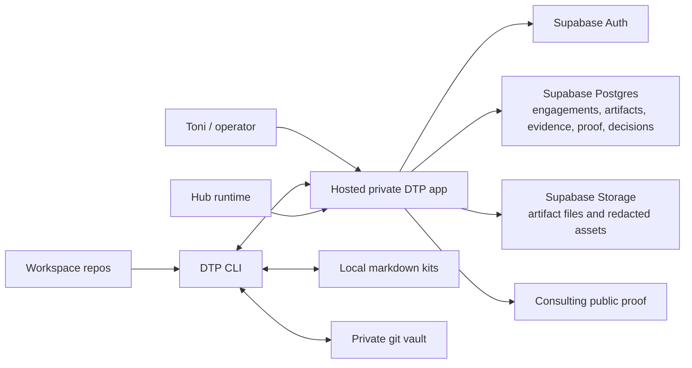
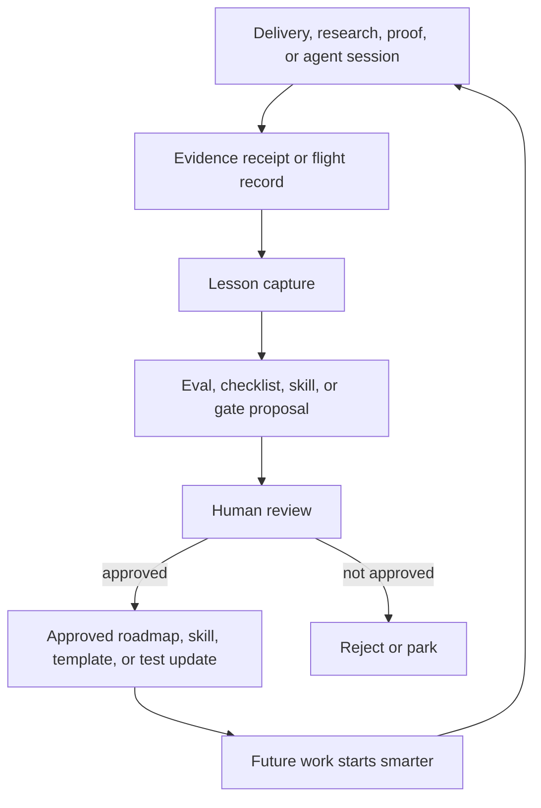
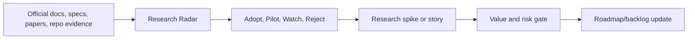
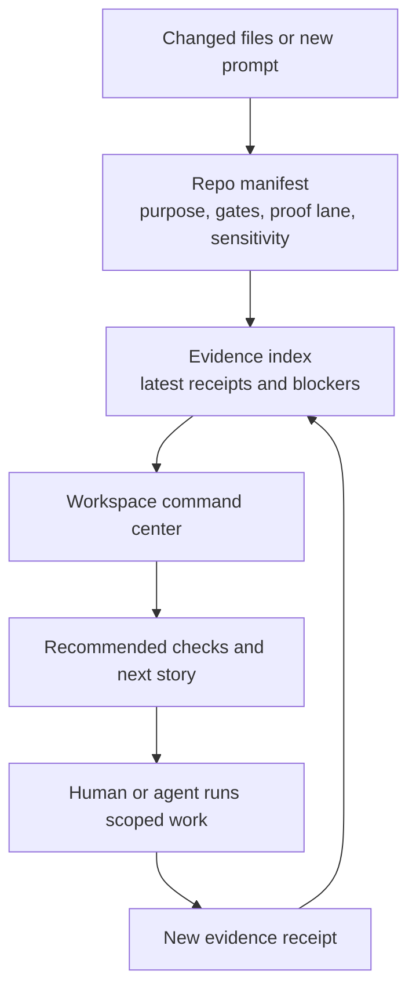
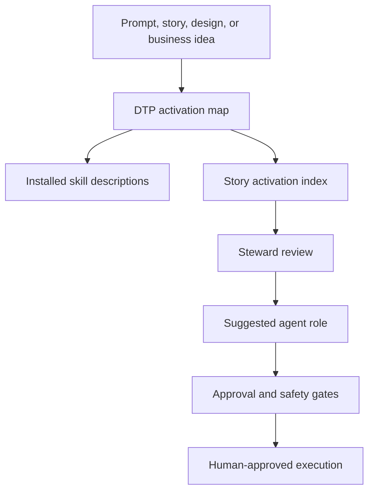
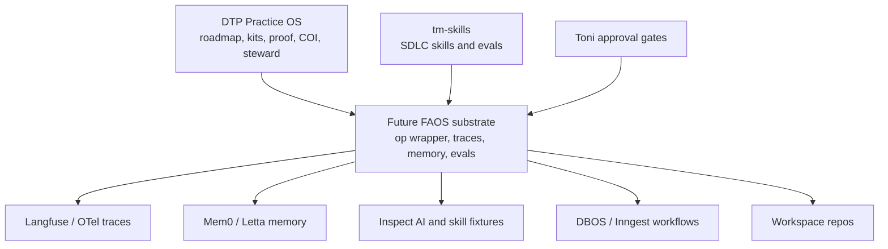

# Practice System Future State

Status: target architecture and sequencing guide. This is not permission to build every future surface now.

Owner: `diagnose-to-plan`

Purpose: define the future consulting operating system so hosted DTP, steward automation, proof governance, research, repo manifests, and agent workflows grow from the current Practice OS without becoming a half-built platform.

## Future-State Thesis

The future system should feel like an operating cockpit for the practice:

- DTP becomes a private hosted Practice OS for engagements, artifacts, evidence, redaction, proof candidates, and decisions.
- Hub remains the runtime intake and operations console.
- Consulting remains the public storefront and proof surface.
- `tm-skills` becomes the reusable cross-repo SDLC behavior layer.
- Repo manifests and evidence indexes make every repo easier for future agents to understand.
- The Roadmap Steward becomes progressively more automated only after the manual loop proves useful.
- Self-learning stays supervised: lessons can propose evals, checklists, skills, and roadmap changes, but humans approve changes.

## Target Hosted DTP Architecture

Target principles:

- Private single-operator first.
- Supabase Auth, RLS, Postgres, and Storage are the likely hosted foundation.
- Local markdown kits and `dtp vault` remain fallback and import/export surfaces.
- Hosted DTP does not replace Hub, consulting, or project repos.
- Dashboards only exist when they connect to real artifacts, evidence, reviews, and decisions.

## Minimum Hosted DTP Domain Model

| Object | Future Purpose |
|---|---|
| Engagement | project/client alias, stage, sensitivity, owner, timestamps, and current operating state |
| Artifact | source item, type, storage pointer, redaction status, proof eligibility, version link |
| Artifact version | immutable record of artifact changes, source hash, imported-from path, and review state |
| Evidence run | repo, branch, commit, command, lane, result, hard/advisory/manual status, artifact path |
| Redaction review | reviewer, status, permission level, redaction notes, next action |
| Proof candidate | public claim, evidence source, caveat, permission, redaction, reviewer, status |
| Decision | context, chosen path, alternatives, consequences, related engagement/artifact/evidence |
| Steward item | active story, repo lane, blocker, gate, follow-up, status |
| Research item | source, classification, relevance, risk, next review, linked story |

Out of scope for Phase 0:

- multi-user SaaS
- CRM replacement
- billing or e-signature
- public client portal
- deep Hub sync
- MCP recall
- autonomous project manager
- dashboard-only views without artifact/evidence backing

## Future Steward And Self-Learning Loop

Rules:

- No self-modifying skills.
- No autonomous repo edits.
- No auto-published proof.
- No client-facing automation without review, logs, rollback, and kill switch.
- Real misfires become evals only after they are understood and normalized.

## Future Research Arm

The research arm should start as curated markdown, not a platform.

Research earns implementation only if it improves at least one of:

- delivery speed
- proof quality
- risk control
- agent performance
- business leverage
- verification quality
- handoff clarity

## Future Repo Manifest, Evidence Index, And Command Center Flow

Future command-center rule: it should orchestrate and explain. It should not own repo rules, centralize secrets, or mutate repos before repo-local gates are encoded.

## Future Agent Activation Model

Target behavior:

- Prompt shape activates the right skill or process.
- Kanban stories carry suggested skills, templates, gates, and agent roles.
- The steward checks repo coverage, stale status, no-touch boundaries, and follow-up capture.
- Actual agent delegation remains explicit.
- Write-enabled automation remains gated.

## Future FAOS Orchestration Substrate

FAOS is the candidate technical substrate for the future version of this activation model. It should not replace DTP; it should make DTP's contracts easier to execute.

Rules:

- FAOS must read DTP roadmap, activation, proof, COI, and stewardship contracts.
- FAOS must not create a second source of truth for client kits, public proof, or repo ownership.
- Tracing and memory require redaction, retention, and sensitivity policy before raw prompt/tool data is captured.
- Phase implementation must start with `docs/FAOS_ORCHESTRATION_ROADMAP.md` and `practice-os/templates/faos-phase-readiness-review.md`.

## Future Documentation Propagation

DTP remains the master source. Other repos get local pointers when their lane is touched:

| Repo | Future Local Pointer Or Doc |
|---|---|
| `consulting` | public proof and Hub intake boundary pointer to DTP system docs |
| `hub` | Hub/DTP/consulting boundary pointer and prompt/registry validation runbook |
| `tm-skills` | skill-trigger alignment note pointing back to DTP activation map |
| `fitness-app` | verification cockpit extraction note and permissioned proof lane |
| `demario-pickleball-1` | command-room reference and proof/launch permission lane |
| `FamilyTrips` | privacy-first validation and private-data boundary note |
| `dse-content` | COI-aware proof and Microsoft-adjacent usage note |
| `engineering-playbook` | doctrine pointer that DTP owns active practice sequencing |
| `hub-prompts` | prompt schema and eval ownership pointer |
| `hub-registry` | registry routing and prompt-id validation pointer |

## Future Gating Ladder

| Future Capability | Gate Before Build |
|---|---|
| hosted DTP schema/app shell | accepted Phase 0 boundary and real pilot records |
| hosted proof dashboard | real proof packets and redaction reviews |
| hosted steward queue | repeated manual steward receipts |
| `dtp steward review` CLI | manual template proves useful and checks are stable |
| repo manifests beyond DTP | DTP pilot accepted, then consulting/Hub/`tm-skills` lanes touched |
| global `tm-skills` install | explicit approval, dry-run review, reload, smoke tests |
| project-pinned skill canary | global discovery works without duplicate confusion |
| Hub prompt/registry automation | prompt ids and registry targets cross-validate |
| AI red-team lab | before public AI workflows or write-enabled agents |
| MCP recall | 2-3 real engagements make manual recall painful |
| AG-UI or agent frontend | real-time state, approvals, and tool progress are needed |
| A2A or multi-agent protocol | multiple independent agents or vendors need interoperability |
| FAOS Phase 0 implementation | Phase 0A readiness review accepted; Langfuse topology, memory isolation, trace redaction, DTP adapter boundary, `uv` package flow, COI ownership, and Spec-Kit CLI syntax corrected |

## Target End State

A future agent should be able to open DTP and answer:

- what exists today
- what the target system is
- which repo owns what
- what should activate for a new prompt or story
- which gate blocks public proof, hosted implementation, or automation
- which repo should be touched next
- what evidence exists
- what should not be touched yet

The human should not have to remember the roadmap by hand.
