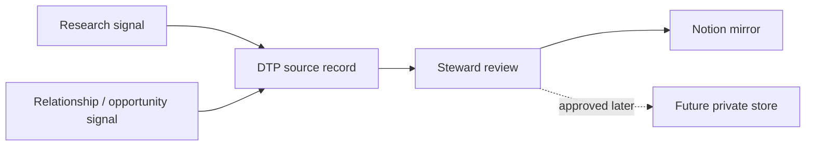

# Research Arm And Opportunity OS Notion Mirror V0

Status: design contract for a future manual Notion mirror. This does not
authorize live Notion writes, autonomous sync, or private relationship storage.

Owner: `diagnose-to-plan`

Purpose: give Toni a phone-friendly way to review research signals and
relationship-led opportunity state while keeping DTP markdown as the source of
truth.

## Source Of Truth

DTP owns the records, gates, and decisions:

- `docs/RESEARCH_ARM_V0.md`
- `docs/OPPORTUNITY_OS_V0.md`
- `practice-os/templates/research-arm-digest.md`
- `practice-os/templates/opportunity-os-record.md`
- `practice-os/research/digests/`
- `practice-os/opportunities/`
- `practice-os/steward/`

Notion is a mirror and review cockpit only.

If Notion and DTP disagree, DTP wins until a steward review intentionally
updates the DTP source record.

## Mirror Goals

This mirror should help Toni quickly answer:

- what research signals deserve attention;
- which signals should be adopted, piloted, watched, or rejected;
- which opportunities are real enough to keep warm;
- which opportunities are blocked by fit, capacity, trust, or missing context;
- which next touch is appropriate;
- which records need a private storage decision before they become operational.

## Mirror Surfaces

### 1. Research Arm

Use this database or linked view for research signals, reports, tools, market
patterns, platform shifts, and implementation ideas.

Properties:

| Property | Type | Notes |
|---|---|---|
| `Name` | title | plain-language signal name |
| `Signal Type` | select | report, tool, workflow pattern, market shift, client pattern, platform change, legal/compliance signal |
| `Classification` | select | Adopt, Pilot, Watch, Reject |
| `Status` | select | Inbox, Needs Review, Accepted, Parked, Converted, Closed |
| `Source Type` | select | PDF, email, web, meeting, repo work, client signal, personal idea |
| `Source Summary` | text | short human summary, not raw pasted source text |
| `Why It Matters` | text | business, delivery, client, or system relevance |
| `Practice Impact` | multi-select | offer, proof, agents, client delivery, research, operations, engineering, legal, finance |
| `Risk Level` | select | low, medium, high |
| `Next Action` | text | one next move, owner-aware |
| `Review Date` | date | when to revisit |
| `DTP Source Path` | url/text | canonical DTP path |
| `Owner` | person/text | usually Toni unless delegated |
| `Last Mirrored At` | date | mirror freshness marker |

Views:

- `Needs Review`: `Status` is Inbox or Needs Review.
- `Pilot`: `Classification` is Pilot.
- `Watch`: `Classification` is Watch.
- `Accepted`: `Status` is Accepted or Converted.
- `Parked`: `Status` is Parked or Closed.

Rule: research can recommend work, but it does not become implementation until
DTP has a story, gate, owner repo, and steward receipt.

### 2. Opportunity OS

Use this database or linked view for sanitized opportunity state. It is not the
private relationship ledger and should not contain raw client replies, private
contact details, private financial facts, private transcripts, or sensitive
relationship notes.

Properties:

| Property | Type | Notes |
|---|---|---|
| `Opportunity` | title | sanitized name, category, or approved public label |
| `Archetype / Category` | select | founder, local operator, professional services, nonprofit, startup, referral, partner, internal |
| `Status` | select | Signal, Qualify, Active, Waiting, Nurture, Parked, Closed |
| `Fit Band` | select | Strong fit, Possible fit, Weak fit, Not a fit |
| `Capacity Label` | select | Now, Soon, Later, Too much right now |
| `Next Touch` | text/date | next safe human action |
| `Relationship Path Summary` | text | sanitized high-level path, no sensitive detail |
| `Primary Need` | multi-select | clarity, build, improve, AI enablement, operating system, growth, proof, launch |
| `Sensitivity` | select | public-safe, internal-only, private-client, COI-gated |
| `Needs Private Store Decision` | checkbox | true when Notion is too light for the real record |
| `DTP Source Path` | url/text | canonical DTP path or steward receipt |
| `Review Date` | date | when to revisit |
| `Last Mirrored At` | date | mirror freshness marker |

Views:

- `Now / Soon`: `Capacity Label` is Now or Soon and `Fit Band` is Strong fit or
  Possible fit.
- `Waiting`: `Status` is Waiting.
- `Nurture`: `Status` is Nurture.
- `Capacity Risk`: `Capacity Label` is Too much right now.
- `Needs Private Store Decision`: checkbox is true.
- `Parked / Closed`: `Status` is Parked or Closed.

Rule: Notion may show sanitized opportunity posture. The real relationship
memory stays in DTP markdown, the private engagement vault, Gmail, or a future
approved private store.

## Allowed Mirror Content

Allowed:

- sanitized names or mock labels;
- broad opportunity category;
- fit band and capacity posture;
- next human action;
- source-path pointer;
- public-safe or internal-only research summaries;
- DTP review dates and status labels;
- short source summaries written by Toni/Codex after review.

Blocked:

- raw client emails;
- private phone numbers or addresses;
- full transcripts;
- private compensation, IP, contract, health, legal, or financial details;
- sensitive relationship history;
- unsupported public claims;
- secrets, tokens, credentials, or account screenshots;
- autonomous outreach instructions.

## First Seed Rows

Seed rows should be created manually only after Toni approves a live Notion pass.

Research Arm seed candidates:

| Name | Classification | Status | Next Action | DTP Source Path |
|---|---|---|---|---|
| AI Agent Operating Shift | Pilot | Accepted | Use to refine Research Arm and Opportunity OS loops | `practice-os/research/digests/2026-05-09-ai-agent-operating-shift.md` |
| Harvey MCP Legal Work Note | Watch | Needs Review | Revisit when legal-review workflow becomes active | `practice-os/steward/2026-05-08-ai-agents-report-and-legal-mcp-research-radar.md` |
| External Communications Agent | Pilot | Converted | Use in client-facing draft review loops | `docs/AGENT_SQUADS_KNOWLEDGE_BASE_V0.md` |

Opportunity OS seed candidates:

| Opportunity | Archetype / Category | Status | Fit Band | Capacity Label | DTP Source Path |
|---|---|---|---|---|---|
| Sanitized Test Record 001 | local operator | Qualify | Strong fit | Soon | `practice-os/opportunities/sanitized-test-records-2026-05-09.md` |
| Sanitized Test Record 002 | founder | Nurture | Possible fit | Later | `practice-os/opportunities/sanitized-test-records-2026-05-09.md` |
| Sanitized Test Record 003 | partner | Parked | Weak fit | Later | `practice-os/opportunities/sanitized-test-records-2026-05-09.md` |

## Sync Direction

Operating rule: DTP-to-Notion is allowed after review. Notion-to-DTP is allowed
only as an inbox capture that receives steward review before it changes source
truth. Two-way automatic sync is not part of V0.

## Acceptance Criteria

A future live Notion mirror pass is acceptable when:

- Research Arm and Opportunity OS have separate views or clearly separated
  database views;
- every row has a DTP source path;
- private relationship detail is absent;
- next actions are human-owned and approval-gated;
- Notion has freshness fields so stale mirrors are obvious;
- DTP docs remain the authoritative path for method, gates, and records;
- a steward receipt records what was mirrored and what was intentionally left
  out.

## Next Actions

1. Keep this as the design contract until Toni approves a live Notion pass.
2. Use the seed rows only as sanitized starter data.
3. Decide the future private relationship store after the manual DTP + Notion
   mirror loop proves what fields are actually useful.
