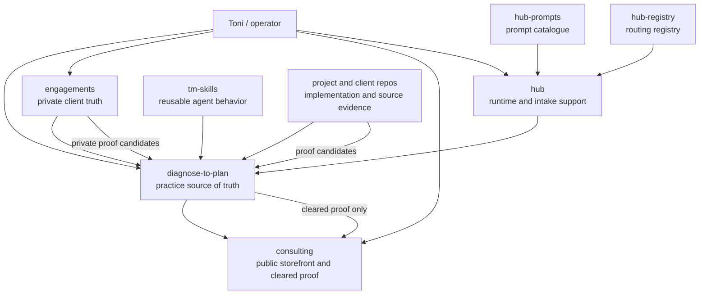

# Workspace Control Plane Report - 2026-05-05

Owner: `diagnose-to-plan`  
Scope: Toni consulting workspace, excluding `dse-content` by instruction  
Evidence date: 2026-05-05  
Report type: internal control-plane artifact, not fresh validation proof

## Report Role

This report is the internal control plane for repo state, proof movement, validation gates, and lane ownership. It is not a code review, not a client-facing roadmap, and not a public positioning asset.

Use it to decide what can be touched, what must stay status-only, what evidence is missing, and which repo owns the next action. Clients should see simpler roadmap and handoff artifacts derived from this control plane, not the control plane itself.

W-2, employer, conflict, and private-proof constraints are internal operating constraints in this report, not legal advice.

## Outcome Ledger

| Outcome | Current operating target |
|---|---|
| Practice outcome | Make the consulting practice share-ready without moving unapproved proof public. |
| Client outcome | Keep private engagement truth current while waiting for owner/client replies. |
| Engineering outcome | Convert dirty worktrees into clean, validated checkpoints. |
| Revenue outcome | Preserve the path to paid audit, launch sprint, and operating-system work without overbuilding internal tools. |
| Risk outcome | Protect W-2 employment, private client material, and public credibility. |

## Definition Of Stable

A repo is not stable because its roadmap is clear. A repo is stable only when:

- branch and commit SHA are recorded;
- worktree is clean, or dirty state is intentionally documented;
- dependency and install state are known;
- required build, lint, typecheck, test, and security gates have run;
- failures are recorded with owner decision: fix now, park, shelve, or accept;
- public/private proof implications are checked;
- next action is small enough to complete in one work block.

If those conditions are not met, this report may record planning or live status, but it must not claim repo-level stability.

## Current Cycle: Allowed Work

Implementation lanes:

1. `diagnose-to-plan`: commit or checkpoint the current roadmap, report, proof synthesis, and control-plane docs.
2. `consulting`: resolve the share-readiness and assistant QA dirty state without starting new public-site scope.
3. `tm-skills`: close out Azure/Foundry incubator changes before treating global skill behavior as stable.

Status-only lanes:

- `diagnose-to-plan/engagements`
- `hub`
- `ccaap-site`
- `fitness-app` / Omnexus
- `demario-pickleball-1`
- `FamilyTrips`
- `architected-strength`
- `hub-prompts`
- `hub-registry`
- `engineering-playbook`

Do not touch this cycle:

- public proof publishing;
- Hub-as-CRM or Hub-as-DTP work;
- autonomous client communications;
- QuickBooks writes or live imports;
- write-enabled cross-repo command runners;
- broad consulting site redesign or new public proof claims.

## 2026-05-05 Operator Reprioritization Addendum

Toni reopened four practical lanes after this report's original synthesis:

1. DeMario's pickleball site is live and receiving strong feedback, so it should move from generic future proof into a permissioned LinkedIn/social proof-prep packet.
2. Omnexus is App Store approved, but subscriptions were declined/not approved, so it should reopen as a manual App Store Connect/IAP resubmission lane before any code rewrite.
3. The consulting site should get a focused fix/readiness pass, not a broad redesign: Hub-first intake, visual QA, route/build checks, proof posture, and Steel Ledger preservation.
4. Architected Strength should be reopened as its own P0/P1 finish/fix pass: public signal, claim hygiene, positioning, craft, and repo-local gates before assistant-pattern work.

Live intake refresh before this addendum showed `consulting`, `diagnose-to-plan`, `architected-strength`, `fitness-app`, and `demario-pickleball-1` clean against their upstream branches. The addendum changes the next-action queue; it does not approve public proof publishing, private screenshots, autonomous posting, assistant runtime, Omnexus code changes without App Store Connect evidence, or a cross-site redesign.

Updated order:

| Order | Lane | Next action | Gate |
|---|---|---|---|
| 1 | DeMario launch-feedback social/proof packet | Draft LinkedIn/social copy and evidence checklist. | Mario-approved wording, testimonial/source evidence, redacted screenshots, launch context, caveat, reviewer, human posting. |
| 2 | Omnexus subscription-review resubmission | Inspect App Store Connect status/reviewer message and prepare version-plus-subscriptions checklist if these are first subscriptions. | Metadata, screenshot, availability, review notes, product IDs, and build/version attachment are verified before code work. |
| 3 | Consulting public-site fix/readiness | Run focused site QA and fix pass. | Build/route/visual/doctor/matrix evidence and no new proof claims without DTP proof gates. |
| 4 | Architected Strength finish/fix | Inspect current site against repo roadmap and implement P0/P1 public-signal polish. | Repo-local gates plus clear boundary from consulting and employer/private material. |

## Evidence Boundary

This report combines three evidence layers:

1. Workspace and DTP planning state: `toni-consulting-ops.code-workspace`, `dtp workspace report --json`, DTP command-center/dashboard docs, DTP roadmap/backlog/horizon docs, and DTP repo manifests/evidence indexes.
2. Repo-local planning state: roadmap, launch, release, verification, current-state, owner-handoff, and validation docs in each included repo.
3. Live local state: `git status --short --branch` and roadmap/planning file discovery in each included repo.

No repo-local roadmap docs were edited. No repo builds or validators were run for this report. DTP's bare `dtp` command was not on PATH in this shell, so the repo-local invocation was used successfully:

```powershell
.\.venv\Scripts\python.exe -m dtp workspace report --json
```

`dse-content` is intentionally excluded from this report even though DTP still has recorded manifest/evidence coverage for it.

## 1. Executive Summary

| Repo / lane | Role | Planning owner | Current state | Next action | Blocker | Validation gate |
|---|---|---|---|---|---|---|
| `consulting` | Public storefront, proof shell, Hub-first intake, share-readiness surface | Repo-local for site execution; DTP for practice/proof sequencing | Dirty on `main...origin/main`; roadmap, assistant QA, package/script, and `/start` changes are uncommitted | Finish share-readiness/assistant QA pass or commit/shelve current site work before new site scope | Public proof cannot move without DTP proof gates; Hub endpoint/live route proof still needs care | `npm run build`, route tests when browser available, `npm run doctor`, `npm run matrix`, `npm run security:secrets` |
| `architected-strength` | Toni personal-brand OS, public signal, assistant-pattern candidate | Repo-local roadmap and planning cockpit; DTP for cross-site assistant/proof promotion | Clean on `main...origin/main` | Keep public signal sprint separate from consulting; revisit assistant only after source/refusal gates | Assistant launch needs accepted manifest, source corpus, refusal policy, logging, handoff, and pilot proof | `pnpm run ci`, optional visual QA/publishing checks |
| `diagnose-to-plan` | Canonical Practice OS, Business Brain, Kaizen, proof governance, roadmap steward | DTP is source of truth | Dirty on `main...origin/main`; active roadmap/proof/dashboard synthesis changes already exist | Add this report, then use it as broad-session preflight before repo touches | Hosted DTP and public proof remain gated; private records must stay out of public docs | `pytest`, `ruff check .`, `dtp skills --validate`, `dtp practice doctor`, redaction checks as needed |
| `diagnose-to-plan/engagements` | Private nested engagement vault and client truth | Private nested repo; DTP public docs can only mirror sanitized status | Clean on `main...origin/main`; private remote appears live now | Treat live git state as fresher than older DTP note saying no private remote; keep status-only public summaries | No public proof or raw client content leaves private lane without permission/redaction/reviewer/caveat | `git status`; `dtp vault status`; private-kit proof/redaction checklists |
| `hub` | Runtime/intake infrastructure, console, prompt execution support | Hub repo for runtime; DTP for practice roadmap | `main...origin/main` with untracked `docs/PR68_TAILWIND4_MIGRATION_PLAN.md` | Execute PR #68 Tailwind 4 migration in a Hub-local pass when reopened | PR #68 checks fail typecheck/build-test despite mergeable status; Hub must not become CRM/DTP | `pnpm verify`; targeted `pnpm format:check`, lint, build, typecheck, test, `pnpm hub doctor` |
| `engineering-playbook` | Doctrine/reference, portfolio ops, historical execution plan | DTP owns active roadmap; playbook owns reusable doctrine | Clean on `main...origin/main` | Revisit only for general doctrine or portfolio-policy changes | Must not become active practice roadmap owner | PowerShell parse check, `.\scripts\portfolio-ops-check.ps1 -StatusOnly`, `git diff --check` |
| `hub-prompts` | Prompt catalogue consumed by Hub | Repo owns prompt markdown/schema; Hub owns runtime proof | Clean on `main...origin/main` | Add eval/golden fixtures only when real prompt changes or misfires justify them | No runtime proof here; runtime evidence belongs in Hub | `npm test`, `npm run validate`, `npm run validate:phase0` |
| `hub-registry` | Prompt routing and automation target registry | Repo owns dispatch target declarations | Clean on `main...origin/main` | Keep full cross-validation local-first; defer sibling CI access | Private sibling CI access intentionally deferred | `npm run validate`, `npm run validate:manifests`, `npm run validate:prompt-ids`, `npm test` |
| `fitness-app` / Omnexus | Product app, App Store/release evidence, verification pattern | Repo-local product roadmap; DTP extracts reusable launch/proof lessons | Clean on `main...origin/main` | Keep Stripe parked per Toni until reopened; use Omnexus as launch-pattern reference only | Public proof gated; Stripe webhook dashboard issue is parked manual support lane | Repo release gates: lint, typecheck, build, schema contract, Supabase lint, verification toolkit when active |
| `FamilyTrips` | Privacy-first family trip/event app | Repo-local roadmap | Clean on `main...origin/main` | Keep static/no-login model; avoid sensitive data in client-side trip objects | Strong privacy requires architecture change; unlisted is casual visibility only | `npm run validate:data`, lint, test, build |
| `demario-pickleball-1` | Local-business launch/admin surface and Command Room reference | Repo-local developer/business/admin roadmaps; DTP for proof routing | Clean on `master...origin/master` | Keep owner/admin launch gates visible; do not promote screenshots/claims yet | Proof permission, review/testimonial source evidence, launch context, and redaction required | `npm run ci`; CI with typecheck, lint, tests, build, E2E |
| `tm-skills` | Global coding-agent skills and install/freshness behavior | Repo owns software-delivery skills; DTP owns practice/process skills | Dirty on `main...origin/main`; active Azure/Foundry/incubator modifications and untracked skill folders | Run a focused closeout on Azure-skill/incubator changes before treating repo as stable | External Claude Code/GitHub Copilot discovery smoke remains manual; Azure batch not fully promoted | `.\scripts\doctor.ps1`, `.\scripts\freshness-check.ps1`, `.\scripts\install.ps1 -WhatIf` |
| `ccaap-site` | CCAAP off-Wix public site implementation | Repo owns public site; private DTP kit owns engagement/proof truth | Clean on `main...origin/main` | Wait for owner launch inputs, Cloudflare Pages connection, authentic assets, PayPal/contact routing, and proof decision | Production blocked by owner inputs and Cloudflare deploy path; public proof internal-only until approved | `pnpm install --frozen-lockfile`, lint, check, content validation, build |

### Actually Active Right Now

- `diagnose-to-plan`: active control plane work. The roadmap, proof queue, dashboard/reporting, Business Brain, Kaizen, steward loop, and documentation map are the center of gravity.
- `consulting`: active public-site/share-readiness work. The worktree has uncommitted roadmap, assistant QA, verification, and `/start` changes.
- `diagnose-to-plan/engagements`: active as private waiting-state truth, but currently clean. It should be read for status only and summarized carefully.
- `tm-skills`: active and dirty, mostly around Azure/Foundry/incubator skill work. This needs a focused closeout before further global-skill assumptions.
- `ccaap-site`: clean but operationally waiting on owner inputs, durable Cloudflare path, and proof permission.
- `hub`: runtime remains important, but PR #68 is parked until a Hub-local Tailwind 4 migration pass.

### Waiting, Parked, Or Should Not Be Touched

- `dse-content`: excluded from this report and should not be pulled into public proof/planning without separate COI-sensitive scope.
- Omnexus Stripe support: parked per Toni until reopened; do not treat it as an active code lane.
- Public proof across Omnexus, DeMario, CCAAP, Architected Strength, Hub/intake, assistant QA, and Business Brain: blocked until DTP proof gates pass.
- Hub-as-CRM, Hub-as-DTP, autonomous client communications, QuickBooks writes/live imports, FAOS implementation, public proof auto-publishing, and write-enabled cross-repo command runner: hold/later lanes, not active implementation.
- FamilyTrips privacy/auth/public sharing: only revisit when a specific trip/event needs stronger privacy.

### Live-Verified Vs DTP-Recorded State

- Live-verified state in this report means local `git status --short --branch` and current file discovery/read checks on 2026-05-05.
- DTP-recorded state means `dtp workspace report --json`, DTP command-center/dashboard docs, DTP roadmap/backlog/horizon docs, and DTP manifest/evidence indexes.
- When live repo state and older DTP notes disagree, this report calls out drift. The most important example is `engagements`: older DTP notes say private remote/durability was not complete, while the live nested repo is currently clean on `main...origin/main`.

## 2. Repo-By-Repo Deep Profiles

### `consulting`

Purpose / owner lane:

- Public consulting storefront at `tonimontez.co`.
- Owns public positioning, Steel Ledger visual baseline, `/start`, public-safe proof shell, launch checklist, hidden/noindex admin launcher, and Hub-first intake route.
- Does not own private engagement records, DTP kits, Hub runtime rows, or proof approval.

Roadmap and planning sources:

- `docs/SITE_NEXT_PASS_ROADMAP.md`
- `docs/PROTOTYPE_DESIGN_ROADMAP.md`
- `docs/repo-os/roadmap.md`
- `docs/repo-os/product-contract.md`
- `docs/repo-os/quality-bar.md`
- `docs/LAUNCH_CHECKLIST.md`
- `docs/ASSISTANT_PUBLIC_V0_QA_CHECKLIST.md` when assistant QA is active
- DTP: proof queue, offer-to-proof matrix, public proof promotion runbook, machine map

Current implementation state:

- Live status: dirty on `main...origin/main`.
- Dirty scope includes roadmap docs, launch checklist, repo-OS roadmap, package/scripts, `/start`, and untracked assistant QA docs/scripts.
- DTP recorded status says recent brand/share-readiness checks passed on 2026-05-04, but current dirty state means the repo needs a commit/shelve/review pass before being called stable.

Now / Next / Later / Parked:

- Now: preserve Steel Ledger baseline, finish Hub endpoint/share-readiness/assistant QA thread, keep `/start` qualification clear, and keep public copy source-backed.
- Next: richer source assets, final public QA, route/build/doctor/security evidence, and DTP-approved proof candidates.
- Later: real booking link, public assistant widget, hosted private DTP link, expanded proof archive, Lighthouse/perf craft pass.
- Parked: full authenticated admin portal, blog scaffold, new backend intake architecture, new design system, productized public AI assistant before gates.

Planning method:

- Repo-local site roadmap owns execution for public site changes.
- DTP owns sequencing, public proof gates, practice offers, and private-to-public promotion.
- Quality bar requires task brief, out-of-scope, acceptance, implementation plan, validation, and diff review.

Validation gates:

- Required for site changes: `npm run build`.
- Relevant repo gates: `npm run doctor`, `npm run matrix`, `npm run security:secrets`, route tests when browser setup is available.
- Intake work should verify rendered endpoint path and Hub CORS when available.

Open blockers:

- Hub endpoint/live route proof must be current before declaring intake fully stable.
- Public proof cannot publish until evidence, permission, redaction, reviewer, and caveat are real.
- Current dirty worktree needs follow-up.

Drift risks:

- Consulting docs can drift toward practice-wide roadmap ownership if DTP is not cited.
- Assistant QA can imply a widget exists if the report does not keep it as pre-implementation/source-corpus QA.
- Proof copy can outrun permission.

Recommended next reporting/action step:

- Finish or checkpoint the dirty share-readiness/assistant QA work and record a DTP steward note with exact validation results.

Future agent read-first list:

- `AGENTS.md`
- `docs/SITE_NEXT_PASS_ROADMAP.md`
- `docs/repo-os/roadmap.md`
- `docs/repo-os/product-contract.md`
- `docs/repo-os/quality-bar.md`
- `docs/LAUNCH_CHECKLIST.md`
- DTP `docs/PUBLIC_PROOF_PROMOTION_RUNBOOK.md`

### `architected-strength`

Purpose / owner lane:

- Toni personal-brand OS, content hub, networking/public signal engine, proof lab, and later public assistant-pattern candidate.
- Separate from `consulting`; it should not become the consulting storefront.

Roadmap and planning sources:

- `docs/roadmap/README.md`
- `docs/roadmap/epics.md`
- `docs/roadmap/kanban-board.md`
- `docs/roadmap/public-signal-sprint-2026-05-04.md`
- `docs/planning/README.md`
- `docs/planning/repo-sync-protocol.md`
- `docs/planning/notion-operating-room.md`
- DTP cross-site assistant brief and Architected Strength assistant manifest candidate

Current implementation state:

- Live status: clean on `main...origin/main`.
- DTP recorded evidence has merged baseline and CI/deploy artifact proof from 2026-05-01.
- Active local planning frames the site as a best-in-class interactive personal-brand OS with Notion as a private planning cockpit and the repo as canonical for approved/versioned artifacts.

Now / Next / Later / Parked:

- Now: public signal sprint and publishing/brand proof improvement without crossing into consulting work.
- Next: Notion planning workspace and manual Notion-to-repo sync.
- Later: cross-site assistant candidate, Azure production flow, artifact attestations, broader content/networking system.
- Parked: live public assistant, private/admin assistant, Azure production deployment, Notion automation, consulting proof/copy.

Planning method:

- Two-layer planning: private Notion cockpit for prioritization/drafts/review; repo canonical for approved roadmap/content/prompts/policies/evals/runbooks/infra.
- DTP owns cross-site assistant/proof promotion and public-copy proof boundaries.

Validation gates:

- `pnpm run ci`.
- Optional/advisory visual QA and publishing/release checks depending on lane.
- AI/assistant work needs source-backed claims, eval/refusal behavior, failure behavior, and logging/handoff plan.

Open blockers:

- Public assistant requires accepted source corpus, refusal policy, logging/analytics plan, handoff path, and launch gate.
- Notion automation should not replace repo canonical flow.

Drift risks:

- It can be accidentally flattened into consulting because both are public Toni surfaces.
- Assistant-pattern work can get ahead of the consulting pilot and DTP cross-site architecture.

Recommended next reporting/action step:

- Keep Architected Strength in the "public signal / later assistant-pattern" lane and only update DTP when a proof/craft lesson is ready for cross-site reuse.

Future agent read-first list:

- `docs/roadmap/README.md`
- `docs/roadmap/kanban-board.md`
- `docs/roadmap/epics.md`
- `docs/roadmap/public-signal-sprint-2026-05-04.md`
- `docs/planning/repo-sync-protocol.md`
- DTP `docs/CROSS_SITE_ASSISTANT_ARCHITECTURE_BRIEF.md`

### `diagnose-to-plan`

Purpose / owner lane:

- Canonical Practice OS, Business Brain, Client Operating Kits, redaction, COI, proof governance, roadmap stewardship, workspace reporting, hosted-DTP planning, templates, and verification spine.
- It is the source of truth for practice-wide planning.

Roadmap and planning sources:

- `docs/PRACTICE_PRODUCTION_ROADMAP.md`
- `docs/ROADMAP_EXECUTION_BACKLOG.md`
- `docs/PRACTICE_ROADMAP_HORIZONS_2026.md`
- `docs/PRACTICE_MACHINE_OPERATING_MAP.md`
- `docs/BUSINESS_BRAIN_OPERATING_SYSTEM.md`
- `docs/PRACTICE_PROOF_QUEUE_INDEX.md`
- `docs/OFFER_TO_PROOF_MATRIX.md`
- `docs/PRACTICE_VERIFICATION_SPINE.md`
- `docs/WORKSPACE_COMMAND_CENTER_V0.md`
- `docs/WORKSPACE_DASHBOARD_READONLY.md`
- `practice-os/efficiency/*-repo-manifest.md`
- `practice-os/efficiency/*-evidence-index.md`
- `practice-os/steward/*`

Current implementation state:

- Live status: dirty on `main...origin/main`.
- Dirty scope includes documentation map, practice roadmap/horizons, proof queue, dashboard, offer/proof, public proof runbook, steward receipts, fixtures, and patterns.
- `dtp workspace report --json` works via the repo-local Python module invocation.

Now / Next / Later / Parked:

- Now: control-plane packaging, proof queue, offer/proof matrix, gate ledger, workspace report/dashboard, private engagement-vault status, Business Brain reset loop, Kaizen, steward receipts.
- Next: second-cycle client reply/template pilot, sanitized Notion mirror, client-loop cadence, hosted DTP one more real operating loop with markdown fallback.
- Later: hosted DTP, saved Kaizen views, steward CLI, memory improvements, Notion apply, prompt/eval garden, cross-site assistants.
- Parked/Hold: Hub-as-CRM, autonomous client communications, QuickBooks writes/live imports, public proof auto-publishing, live cross-repo command runner, FAOS implementation.

Planning method:

- Strategic roadmap says what matters and why.
- Execution backlog tracks epics/stories/statuses/done gates/next actions.
- Horizon overlay adds urgent/short/mid/long timing without becoming a second roadmap.
- Kaizen captures meaningful ideas/asks/blockers/proof candidates before promotion.
- Roadmap steward receipts record active lane, gates, blockers, and no-touch boundaries.

Validation gates:

- DTP code/docs: `pytest`, `ruff check .`, `dtp skills --validate`, `dtp practice doctor`.
- Extraction/synthesis as needed: `dtp index --all`, `dtp synthesize --no-confirm`.
- Proof movement: redaction checks and public proof promotion runbook.
- Report-only doc work: `git diff --check`.

Open blockers:

- Hosted DTP should not become normal client-sensitive workflow until one more real operating loop proves markdown fallback and review gates.
- Public proof remains blocked until proof gates pass.
- Current dirty DTP worktree needs a coherent commit/checkpoint.

Drift risks:

- Multiple roadmap docs can diverge if backlog, horizon, documentation map, and steward receipts are not kept linked.
- DTP workspace dashboard/report can age if manifests/evidence indexes are not updated during repo touch passes.
- Public DTP docs must not absorb raw private engagement truth.

Recommended next reporting/action step:

- Use this report as the broad-session preflight artifact, then update only the specific owning doc when a lane changes.

Future agent read-first list:

- `docs/DOCUMENTATION_MAP.md`
- `docs/PRACTICE_MACHINE_OPERATING_MAP.md`
- `docs/PRACTICE_PRODUCTION_ROADMAP.md`
- `docs/ROADMAP_EXECUTION_BACKLOG.md`
- `docs/PRACTICE_ROADMAP_HORIZONS_2026.md`
- `docs/WORKSPACE_COMMAND_CENTER_V0.md`
- `docs/PUBLIC_PROOF_PROMOTION_RUNBOOK.md`

### `diagnose-to-plan/engagements`

Purpose / owner lane:

- Private nested repo for client/prospect engagement truth, waiting states, proof packets, reply intake, handoffs, owner-action packets, and client-specific planning.
- It is a private lane inside the DTP workspace and should be summarized publicly only at status/gate level.

Roadmap and planning sources:

- `README.md`
- `2026-05-04-engagement-vault-status.md`
- `client-follow-up-send-queue-2026-05-02.md`
- `cameron-mckesson/smb-ma-platform/*`
- `greg-thegrantapp/*`
- `mom-nonprofit/site-rebuild/*`
- DTP recurring client cadence and client reply intake operating patterns

Current implementation state:

- Live status: clean on `main...origin/main`.
- This supersedes older DTP-recorded notes that described the vault as dirty or without private remote durability.
- Lane status remains waiting-focused: Cameron waiting on requested packet, Greg waiting on reply/discovery cadence, CCAAP waiting on owner inputs and proof decision.

Now / Next / Later / Parked:

- Now: private waiting-state truth and reply-intake source.
- Next: on the next real reply, run DTP reply intake before scheduling/build/proof movement.
- Later: convert cleared patterns into DTP proof packets or offer learning only after review.
- Parked: public proof, named claims, raw screenshots, private client facts in public DTP docs.

Planning method:

- Private kits hold raw or sensitive engagement details.
- DTP public docs hold only sanitized status, proof posture, and next gates.
- Reply intake updates private kit first, then optional sanitized Notion/DTP status.

Validation gates:

- `git status` in nested repo.
- `dtp vault status` when needed.
- Proof packet, redaction queue, permission/reviewer checklist, public claim review before any external proof.

Open blockers:

- No public proof permission is complete.
- CCAAP production/proof depends on owner inputs.
- Cameron/Greg lanes wait on replies or approved discovery cadence.

Drift risks:

- Older public DTP notes can be stale relative to the private nested repo.
- Summaries can leak too much if future agents copy private details.
- Notion mirror must remain sanitized and status-only.

Recommended next reporting/action step:

- Add a fresh DTP steward receipt noting the live clean/private-remote state when engagement-vault durability is next touched.

Future agent read-first list:

- `engagements/README.md`
- `engagements/client-follow-up-send-queue-2026-05-02.md`
- DTP `docs/CLIENT_REPLY_INTAKE_OPERATING_PATTERN.md`
- DTP `docs/RECURRING_CLIENT_CADENCE_OPERATING_PATTERN.md`
- DTP `docs/PUBLIC_PROOF_PROMOTION_RUNBOOK.md`

### `hub`

Purpose / owner lane:

- Runtime/intake support for consulting and practice operations.
- Owns intake runtime, private console operations, prompt/routing execution evidence, webhooks, cron support, Supabase runtime rows, health/status endpoints, and runtime proof.
- Does not own DTP roadmap, private kits, public consulting proof, CRM, billing, client portal, or DTP cockpit.

Roadmap and planning sources:

- `ROADMAP.md`
- `docs/HUB_RUNTIME_CURRENT_STATE.md`
- `docs/PR68_TAILWIND4_MIGRATION_PLAN.md`
- `docs/audit-2026-04-22.md`
- `docs/audits/*`
- DTP workspace report and machine map

Current implementation state:

- Live status: `main...origin/main` with untracked `docs/PR68_TAILWIND4_MIGRATION_PLAN.md`.
- DTP recorded latest local gate on 2026-05-03 passed `pnpm verify`.
- The current-state doc is more reliable than older roadmap language for active runtime boundaries.

Now / Next / Later / Parked:

- Now: keep current-state map clear, preserve runtime/intake support role, and avoid CRM/DTP expansion.
- Next: execute PR #68 Tailwind 4 migration/fix plan when dependency lane is reopened.
- Later: Hub-as-MCP, webhook/cron improvements, prompt runtime evidence, clearer legacy surface isolation.
- Parked: Hub-as-CRM, DTP replacement, public proof owner, client portal by default, broad prompt/registry CI sibling access unless needed.

Planning method:

- Hub-local docs own runtime state and PR/dependency execution plans.
- DTP decides whether runtime evidence should become proof or practice process.
- Prompt catalogue and registry changes stay in sibling repos, not Hub roadmap by default.

Validation gates:

- Broad: `pnpm verify`.
- Targeted PR #68: `pnpm format:check`, `pnpm lint`, `pnpm build`, `pnpm typecheck`, `pnpm test`, `pnpm hub doctor`.
- Manual gates for live Supabase writes, service-role operations, intake cleanup, and webhook tests.

Open blockers:

- PR #68 Tailwind 4 migration must be executed before reopening/replacing dependency PR work.
- Private sibling-repo CI access remains intentionally deferred.

Drift risks:

- `ROADMAP.md` can read historical compared with `docs/HUB_RUNTIME_CURRENT_STATE.md`.
- Hub expansion can accidentally become CRM, DTP, proof engine, or client portal.

Recommended next reporting/action step:

- Commit or intentionally keep untracked PR #68 migration plan with a DTP note linking it as parked/current visible blocker.

Future agent read-first list:

- `docs/HUB_RUNTIME_CURRENT_STATE.md`
- `docs/PR68_TAILWIND4_MIGRATION_PLAN.md`
- `ROADMAP.md`
- DTP `docs/PRACTICE_MACHINE_OPERATING_MAP.md`
- DTP `docs/WORKSPACE_OPERATOR_RUNBOOK.md`

### `engineering-playbook`

Purpose / owner lane:

- Doctrine/reference repo for reusable portfolio schemas, templates, historical decisions, secret-management references, and general operating doctrine.
- It should point to DTP for active practice sequencing.

Roadmap and planning sources:

- `README.md`
- `90_DAY_EXECUTION_ROADMAP_v2.md`
- `decisions/2026-04-29-practice-roadmap-source-of-truth.md`
- `AGENTS.md`

Current implementation state:

- Live status: clean on `main...origin/main`.
- The repo explicitly says DTP is the current practice-production roadmap source of truth.

Now / Next / Later / Parked:

- Now: reference only.
- Next: update only when reusable doctrine/policy changes.
- Later: CI or portfolio ops improvements if justified.
- Parked: active roadmap execution ownership.

Planning method:

- DTP owns current roadmap.
- Engineering playbook owns stable doctrine, historical rationale, and broad operating patterns.

Validation gates:

- PowerShell parse check for changed scripts.
- `.\scripts\portfolio-ops-check.ps1 -StatusOnly`.
- `git diff --check`.

Open blockers:

- None in live state.
- Strategic blocker is conceptual: do not let it become a duplicate roadmap owner.

Drift risks:

- Historical `90_DAY_EXECUTION_ROADMAP_v2.md` can be mistaken for current execution plan.
- Portfolio scripts can age if repo list/gates change.

Recommended next reporting/action step:

- Leave clean; update only when doctrine changes or DTP source-of-truth pointer drifts.

Future agent read-first list:

- `README.md`
- `decisions/2026-04-29-practice-roadmap-source-of-truth.md`
- `AGENTS.md`
- `90_DAY_EXECUTION_ROADMAP_v2.md`

### `hub-prompts`

Purpose / owner lane:

- Prompt catalogue for Hub.
- Owns prompt markdown, prompt frontmatter schema, validation, Phase 0 prompt metadata, and prompt body quality.
- Does not own routing targets or runtime dispatch proof.

Roadmap and planning sources:

- `README.md`
- `SCHEMA.md`
- `prompts/*.md`
- `scripts/validate-prompts.mjs`
- `scripts/validate-phase0-prompts.mjs`

Current implementation state:

- Live status: clean on `main...origin/main`.
- DTP recorded latest prompt validation as passing on 2026-04-30.

Now / Next / Later / Parked:

- Now: stable catalogue.
- Next: add or update prompts only when Hub behavior needs it.
- Later: golden fixtures/evals from real misfires.
- Parked: changing prompts merely because the roadmap changed.

Planning method:

- Local-first validation.
- Prompt IDs, versioning, owner/review metadata, expected output schema, golden tests, and changelog sections guide readiness.
- Runtime proof belongs in Hub.

Validation gates:

- `npm test`.
- `npm run validate`.
- `npm run validate:phase0`.

Open blockers:

- None for catalogue validation.
- High-impact prompt behavior needs owner review and future eval/golden fixture review.

Drift risks:

- Prompt catalogue can drift from registry target IDs.
- Placeholder prompt bodies can be accidentally treated as production-ready.

Recommended next reporting/action step:

- Leave clean; only touch during a prompt behavior change or real misfire-to-fixture pass.

Future agent read-first list:

- `README.md`
- `SCHEMA.md`
- `prompts/`
- `scripts/validate-prompts.mjs`

### `hub-registry`

Purpose / owner lane:

- Target registry for Hub automation.
- Owns which prompts run against which repos, triggers, and settings.
- Does not own prompt bodies or Hub runtime implementation.

Roadmap and planning sources:

- `README.md`
- `targets.yml`
- `scripts/validate-registry.mjs`
- `scripts/validate-manifests.mjs`
- `scripts/validate-prompt-ids.mjs`

Current implementation state:

- Live status: clean on `main...origin/main`.
- DTP recorded latest local full gate as passing on 2026-04-30.

Now / Next / Later / Parked:

- Now: stable local-first registry validation.
- Next: update only when dispatch targets or triggers change.
- Later: sibling CI access if local-first validation becomes a bottleneck.
- Parked: private sibling CI access, non-manual trigger activation, confidential target activation, production dispatch changes without approval.

Planning method:

- Registry declares routing behavior; Hub executes it.
- Full local gate cross-validates sibling prompt IDs and manifests.
- CI intentionally remains thin for repo-scoped validation.

Validation gates:

- `npm run validate`.
- `npm run validate:manifests`.
- `npm run validate:prompt-ids`.
- `npm test`.

Open blockers:

- Private sibling-repo CI access is intentionally deferred.

Drift risks:

- Registry targets can reference missing prompt IDs if full local gate is skipped.
- Trigger changes can imply automation behavior before governance catches up.

Recommended next reporting/action step:

- Keep clean and local-first; revisit CI only if it becomes operationally painful.

Future agent read-first list:

- `README.md`
- `targets.yml`
- `scripts/validate-registry.mjs`
- `scripts/validate-prompt-ids.mjs`

### `fitness-app` / Omnexus

Purpose / owner lane:

- Product app and mobile launch evidence source.
- Owns app roadmap, release train, App Store approval/repair docs, operations runbooks, billing/subscription surfaces, verification cockpit, and product proof.
- DTP extracts reusable verification/mobile-launch/proof lessons only.

Roadmap and planning sources:

- `docs/roadmap/README.md`
- `docs/roadmap/execution-backlog-2026.md`
- `docs/roadmap/post-app-store-audit-roadmap.md`
- `docs/ops/post-approval-live-proof-checklist.md`
- `docs/engineering/release-strategy.md`
- `docs/engineering/release-day.md`
- launch/store/ops docs

Current implementation state:

- Live status: clean on `main...origin/main`.
- DTP recorded App Store approval baseline on 2026-05-01, live proof checklist added, and Stripe support alert parked per Toni.

Now / Next / Later / Parked:

- Now: post-approval live proof checklist and first-72-hour trust/ops checks when Omnexus lane is active.
- Next: P9 business readiness, premium polish, retention, reliability/release gates.
- Later: category-leading differentiators, biomarker/recovery proof-first discovery, broader launch/business expansion.
- Parked: Stripe webhook-disabled support lane until Toni reopens; public proof until DTP gates pass.

Planning method:

- Planning hierarchy: product roadmap, execution backlog/release lanes, story packs, release strategy, ops runbooks.
- App Store/release evidence stays repo-local; DTP captures reusable patterns.

Validation gates:

- Release gates include lint, typecheck, build, schema contract, Supabase lint, local verification toolkit when local Docker/Supabase is available.
- CI/security/release verification toolkit for release evidence.
- Manual gates for App Store Connect, IAP, device QA, production dashboards, Stripe dashboard, and private proof evidence.

Open blockers:

- Public proof blocked until evidence, permission, redaction, reviewer, and caveat are complete.
- Stripe support lane parked; when reopened, action is Stripe Dashboard endpoint correction/re-enable/replay/state verification, not assumed app code.

Drift risks:

- Post-App-Store docs can be misread as current validation proof if manual checklist remains pending.
- Stripe parked state can be accidentally reopened by code work instead of dashboard/support triage.

Recommended next reporting/action step:

- Keep as reference-pattern mode in DTP; run repo-local validation only when Omnexus lane is explicitly active.

Future agent read-first list:

- `docs/roadmap/README.md`
- `docs/roadmap/execution-backlog-2026.md`
- `docs/roadmap/post-app-store-audit-roadmap.md`
- `docs/ops/post-approval-live-proof-checklist.md`
- `docs/engineering/release-strategy.md`
- DTP `docs/MOBILE_APP_REVIEW_AND_LAUNCH_PATTERN.md`

### `FamilyTrips`

Purpose / owner lane:

- Casual family/friends trip and event planning app.
- Privacy-first in the practical sense: simple shared links, no login, static-first, owner PIN override path.

Roadmap and planning sources:

- `ROADMAP.md`
- `README.md`
- `docs/AUDIT_PROMPT.md`

Current implementation state:

- Live status: clean on `main...origin/main`.
- DTP recorded local data/lint/test/build passing on 2026-04-30.

Now / Next / Later / Parked:

- Now: content review before sharing links more widely; avoid sensitive details in static trip data.
- Next: owner editing/override refinements and event-planning in the same simple no-account style.
- Later: stronger privacy only for a specific trip/event need.
- Parked: heavy auth, broad AI features, public sharing, or database redesign without real risk/need.

Planning method:

- Repo-local roadmap uses Now/Next/Later/Principles.
- Static seed plus Supabase overrides model keeps source fallback while owner edits can save live.
- DTP treats it as adjacent privacy/reference lane, not practice roadmap.

Validation gates:

- `npm run validate:data`.
- `npm run lint`.
- `npm run test`.
- `npm run build`.

Open blockers:

- Strong privacy requires architecture change.
- Unlisted trips are casual visibility only, not authentication.

Drift risks:

- Future agents may overstate privacy.
- Sensitive data in client-side trip objects would ship in the JavaScript bundle.
- AI/auth/public-sharing ideas can overcomplicate the intentionally casual model.

Recommended next reporting/action step:

- Leave clean; only reopen for a concrete family/event need or privacy-sensitive data request.

Future agent read-first list:

- `README.md`
- `ROADMAP.md`
- `docs/AUDIT_PROMPT.md`

### `demario-pickleball-1`

Purpose / owner lane:

- Local-business launch/admin surface for DeMario pickleball lessons.
- Owns booking/admin surface, owner tasks, owner roadmap, venue-routing rules, Mario action plan, developer roadmap, release checklist, and handoff docs.
- DTP owns only proof-governance routing and reusable Client Command Room pattern extraction.

Roadmap and planning sources:

- `docs/DEVELOPER_PLAN.md`
- `docs/phase-3-plan.md`
- `docs/LAUNCH_OUTSTANDING.md`
- `docs/RELEASE_CHECKLIST.md`
- `docs/ADMIN_HANDOFF.md`
- `docs/MARIO_ACTION_PLAN.md`
- `/admin/roadmap` and `/admin/site-roadmap` as live app surfaces when running

Current implementation state:

- Live status: clean on `master...origin/master`.
- DTP recorded latest local/CI checks passing in late April.
- Business/admin and developer roadmaps are intentionally split.

Now / Next / Later / Parked:

- Now: controlled owner/admin launch use, venue-routing matrix, manual launch gates, Mario action plan.
- Next: finalize Google Calendar connection, live booking/manual QA, owner tasks, proof-on-file for launch claims.
- Later: student cancellation/reschedule links, analytics, DUPR sync after official access, Stripe Checkout.
- Parked: public proof screenshots/claims, AI-native ops assistant, private CRM notes, broad promotion before gates.

Planning method:

- Developer roadmap tracks Tonio's code/ops tasks.
- Business roadmap/admin tasks track Mario's operating actions.
- Release checklist separates code, Supabase, admin/security, monitoring, Google Calendar OAuth, manual checks, and business gates.

Validation gates:

- `npm run ci`.
- CI on `master` includes install, typecheck, lint, tests, build, Playwright browser install, and E2E.
- Manual gates for booking emails, cancellation, payments/QR, Google Calendar, MFA/admin handoff, venue and policy proof.

Open blockers:

- Review/testimonial claims and screenshots require source evidence and explicit permission before public proof.
- Broader promotion waits on final live checks and venue/policy proof.
- Student self-cancel/reschedule remains future work.

Drift risks:

- Owner-facing roadmap can diverge from developer docs.
- Public proof can outrun permission.
- Future payment automation can conflict with manual launch payment rules if rushed.

Recommended next reporting/action step:

- Keep as reference implementation; do not promote into consulting until DTP proof packet clears.

Future agent read-first list:

- `docs/DEVELOPER_PLAN.md`
- `docs/LAUNCH_OUTSTANDING.md`
- `docs/RELEASE_CHECKLIST.md`
- `docs/ADMIN_HANDOFF.md`
- `docs/MARIO_ACTION_PLAN.md`
- DTP `docs/CLIENT_COMMAND_ROOM_PATTERN.md`

### `tm-skills`

Purpose / owner lane:

- Global software-delivery skill repo for coding-agent behavior.
- Owns SDLC skills, install/freshness/doctor scripts, global instructions, misfire capture, and external tool smoke runbooks.
- DTP owns consulting/practice-process skills, proof/redaction/COI templates, and practice roadmap.

Roadmap and planning sources:

- `README.md`
- `MISFIRES.md`
- `docs/EXTERNAL_TOOL_SMOKE_RUNBOOK.md`
- `docs/AZURE_SKILLS_INCUBATOR_AUDIT_2026-05-03.md`
- `manifest.json`
- `skills/*/SKILL.md`
- `scripts/doctor.ps1`
- `scripts/freshness-check.ps1`
- `scripts/install.ps1`

Current implementation state:

- Live status: dirty on `main...origin/main`.
- Dirty scope is substantial and concentrated around Azure/Foundry/Entra skill changes, deleted eval output/trigger artifacts, and many untracked Azure skill folders.
- DTP recorded tm-skills smoke/doctor success from 2026-05-03, but live state is now newer and not clean.

Now / Next / Later / Parked:

- Now: Phase 1 SDLC skills and current Azure-skill/incubator closeout.
- Next: external Claude Code/GitHub Copilot discovery smoke and misfire recording.
- Later: more eval/golden fixtures, cross-tool behavior hardening, carefully promoted Azure subset.
- Parked: broad Azure batch promotion without smoke/use validation; moving DTP operator skills into tm-skills.

Planning method:

- Phase 1 focuses on review-checklist, frontend-craft, backend-design, testing-ladder, delivery-baseline.
- Azure/Entra/Microsoft subset is incubator-style, not Phase 1 core.
- Misfires become real improvement records and may feed DTP promotion fields.

Validation gates:

- `.\scripts\doctor.ps1`.
- `.\scripts\freshness-check.ps1`.
- `.\scripts\install.ps1 -WhatIf`.
- Manual external tool reload/smoke for Claude Code and GitHub Copilot.

Open blockers:

- Current dirty Azure/incubator changes need focused review, validation, and either commit or parking.
- External tool smoke remains manual.

Drift risks:

- DTP practice skills and tm-skills SDLC skills can blur.
- Azure incubator can look globally production-ready before smoke gates pass.
- Deleted eval artifacts can weaken future discovery if not intentional.

Recommended next reporting/action step:

- Run a dedicated tm-skills closeout: inventory dirty changes, decide promoted vs incubator vs delete, run doctor/freshness/install preview, record misfires.

Future agent read-first list:

- `README.md`
- `MISFIRES.md`
- `docs/EXTERNAL_TOOL_SMOKE_RUNBOOK.md`
- `docs/AZURE_SKILLS_INCUBATOR_AUDIT_2026-05-03.md`
- `manifest.json`
- DTP `docs/TM_SKILLS_IMPLEMENTATION_ROADMAP.md`

### `ccaap-site`

Purpose / owner lane:

- Public off-Wix CCAAP site implementation.
- Owns public site build, Cloudflare Pages target, owner launch inputs, deployment runbook, launch checklist, public content placeholders, and owner review packet.
- Private engagement/proof truth belongs in `diagnose-to-plan/engagements`.

Roadmap and planning sources:

- `docs/PROTOTYPE_PLAN.md`
- `docs/OWNER_LAUNCH_INPUTS.md`
- `docs/OWNER_QUESTIONNAIRE.md`
- `docs/LAUNCH_CHECKLIST.md`
- `docs/DEPLOYMENT_RUNBOOK.md`
- Private DTP engagement kit status for proof/owner-input posture

Current implementation state:

- Live status: clean on `main...origin/main`.
- DTP recorded temporary preview/local checks on 2026-05-01 as pass with advisory.
- Cloudflare Pages connection remains pending.

Now / Next / Later / Parked:

- Now: wait for owner launch inputs and review, keep placeholders explicit, maintain internal-only proof status.
- Next: PayPal donate/membership links, contact routing, meeting destination, DNS/domain path, authentic assets/resources, Cloudflare preview, owner review.
- Later: production launch, after-state evidence, proof packet promotion if owner approves.
- Parked: public consulting proof, assistant work, private portal/command room before fit assessment.

Planning method:

- Repo tracks public site launch blockers and deployment path.
- Private engagement kit tracks owner facts, proof gates, and waiting state.
- DTP proof governance controls any case-study movement.

Validation gates:

- `pnpm install --frozen-lockfile`.
- `pnpm lint`.
- `pnpm check`.
- `pnpm validate:content`.
- `pnpm build`.
- Cloudflare preview/production gates are manual/deploy-environment gates.

Open blockers:

- Production launch waits on PayPal links, contact routing, DNS/domain access, authentic photos/resources, Leah plus Tony review, and proof decision.
- Wrangler/Cloudflare deploy path was previously blocked by local tooling/API token/platform issues.

Drift risks:

- Public site can look launch-ready while owner inputs are still pending.
- Proof could be inferred from public nonprofit material before permission/redaction/reviewer gates.
- DTP private kit and site docs can diverge if owner replies are not processed through reply intake.

Recommended next reporting/action step:

- Keep clean; next action is owner-input collection, not more site implementation.

Future agent read-first list:

- `docs/PROTOTYPE_PLAN.md`
- `docs/OWNER_LAUNCH_INPUTS.md`
- `docs/OWNER_QUESTIONNAIRE.md`
- `docs/LAUNCH_CHECKLIST.md`
- `docs/DEPLOYMENT_RUNBOOK.md`
- DTP private engagement kit status summary

## 3. Cross-Repo Planning System

### System Context



System boundaries:

- Private truth lives in `engagements` and never moves raw into public DTP or consulting.
- Public proof lives in `consulting` only after DTP evidence, permission, redaction, reviewer, and caveat gates.
- Runtime support lives in Hub; Hub may produce evidence, but it does not own the roadmap or CRM.
- Reusable agent/runtime behavior lives in `tm-skills`, `hub-prompts`, and `hub-registry`; those repos do not own product roadmap.

### How DTP Controls Roadmap Truth

DTP is the roadmap source of truth because it is the only place that sees the whole practice without flattening every repo into one product. It owns:

- Practice production roadmap.
- Execution backlog and Done gates.
- Horizon overlay.
- Business Brain / Consulting OS.
- Kaizen intake and status movement.
- Roadmap Steward receipts.
- Proof queue and proof promotion gates.
- Workspace Command Center V0 and recorded workspace report.
- Repo manifests and evidence indexes.

Repo-local docs are authoritative for their own implementation lanes, but DTP decides cross-repo sequencing, proof movement, and which lane is active.

### How Repo-Local Roadmaps Feed Into DTP

Each repo keeps local planning close to its implementation:

- `consulting` owns public site launch/proof/assistant-source readiness.
- `architected-strength` owns personal-brand OS and public signal roadmap.
- `hub` owns runtime/intake current state and PR/dependency plans.
- `fitness-app`, `demario-pickleball-1`, `FamilyTrips`, and `ccaap-site` own their project/product launch docs.
- `tm-skills`, `hub-prompts`, and `hub-registry` own agent/prompt/routing behavior.
- `engineering-playbook` owns doctrine only.

DTP should ingest this through manifests, evidence indexes, steward receipts, proof queue rows, and summary reports. It should not bulk-edit repo-local roadmaps just because a cross-repo report exists.

### How `engagements` Feeds Private Client Truth

`diagnose-to-plan/engagements` is the private nested repo/lane. It owns private client/prospect facts, reply-intake records, send queues, waiting states, proof packets, owner-action packets, and handoffs.

Public DTP docs may record:

- lane name,
- status,
- next gate,
- proof posture,
- whether a reply is needed,
- whether public proof is blocked.

Public DTP docs should not copy raw client notes, private screenshots, credentials, personal contact details, sensitive facts, financial details, or unreviewed proof claims.

### How Hub Supports Runtime/Intake Without Becoming The Practice CRM

Hub supports runtime operations:

- consulting intake endpoint,
- private console,
- prompt execution support,
- prompt/routing runtime evidence,
- webhook/cron support,
- Supabase runtime records,
- health/status surfaces.

Hub should not become:

- canonical roadmap,
- private engagement kit,
- business CRM,
- accounting/billing system,
- proof owner,
- public consulting site,
- DTP cockpit.

The practical rule: Hub can prove runtime behavior; DTP decides what that behavior means for the practice.

### How Proof Moves From Project Repo Or Private Kit To Consulting

Proof moves in this order:

1. Source lives in owning repo or private engagement kit.
2. DTP records proof candidate in proof queue.
3. Evidence-source checklist verifies source quality.
4. Permission/reviewer checklist confirms approval.
5. Redaction queue removes private/sensitive material.
6. Public claim review approves exact wording and caveats.
7. Consulting receives only the cleared proof/copy/screenshot.

Nothing should move directly from Omnexus, DeMario, CCAAP, Architected Strength, Hub, DSE, or private engagements into consulting public pages without that path.

### How `tm-skills`, `hub-prompts`, And `hub-registry` Support Behavior

These repos support agent/runtime behavior but do not own product roadmap:

- `tm-skills`: reusable coding-agent software-delivery behavior, install rules, smoke tests, misfires.
- `hub-prompts`: prompt catalogue and prompt schema.
- `hub-registry`: dispatch target registry and trigger governance.

DTP may record their readiness, blockers, and gates. It should not mutate them for roadmap-only work. Changes there can alter agent/runtime behavior and need their own implementation request.

## 4. Gaps And Recommendations

### Missing Or Weak Planning Surfaces

- `engagements` live state should be re-summarized in a public DTP steward receipt because older DTP docs are stale about private remote/durability.
- `hub` should commit or explicitly track `docs/PR68_TAILWIND4_MIGRATION_PLAN.md` so the parked blocker is not invisible.
- `tm-skills` needs a current Azure/incubator closeout note because live dirty state has moved past the 2026-05-03 audit.
- `consulting` assistant QA/share-readiness work needs a clean checkpoint because it is currently split across dirty docs/scripts/routes.
- `ccaap-site` needs owner-input follow-up before more implementation.

### Stale Roadmap Risks

- DTP horizon/steward docs can disagree with live nested `engagements` state.
- Hub `ROADMAP.md` is useful history but should defer to `docs/HUB_RUNTIME_CURRENT_STATE.md` for active runtime boundaries.
- `engineering-playbook/90_DAY_EXECUTION_ROADMAP_v2.md` is historical and should not be treated as active sequencing.
- `fitness-app` post-approval docs can look complete while manual proof matrix items remain pending.
- `FamilyTrips` unlisted route language can be misread as security if future docs are not precise.

### Dirty Worktrees Needing Follow-Up

- `consulting`: active uncommitted roadmap, assistant QA, verification, package/script, and `/start` changes.
- `diagnose-to-plan`: active uncommitted roadmap/proof/dashboard/synthesis/steward changes plus this new report.
- `hub`: untracked PR #68 migration plan.
- `tm-skills`: substantial active Azure/Foundry/incubator changes.

Clean at report time:

- `architected-strength`
- `diagnose-to-plan/engagements`
- `engineering-playbook`
- `hub-prompts`
- `hub-registry`
- `fitness-app`
- `FamilyTrips`
- `demario-pickleball-1`
- `ccaap-site`

### Repos Where DTP And Repo-Local Roadmaps May Disagree

- `engagements`: DTP note drift around private remote/durability versus live clean nested repo.
- `hub`: older roadmap versus current-state doc and PR #68 plan.
- `consulting`: DTP recorded recent pass, but live worktree is dirty with newer assistant/share-readiness changes.
- `tm-skills`: DTP recorded clean smoke/pass, but live repo has new active dirty incubator work.
- `fitness-app`: DTP says Stripe parked; repo-local docs still contain broader billing/resilience roadmap that should not be interpreted as active support work.
- `engineering-playbook`: historical 90-day roadmap versus DTP source-of-truth decision.

### Suggested Monthly Reporting Cadence

Monthly workspace report:

1. Run repo status sweep for included repos.
2. Run `.\.venv\Scripts\python.exe -m dtp workspace report --json`.
3. Check DTP active queue, proof queue, roadmap horizons, and steward receipts.
4. Review private `engagements` status, then summarize only sanitized lane/status/gate facts.
5. Identify dirty worktrees, parked lanes, stale docs, and proof candidates.
6. Update one DTP report or steward receipt; do not bulk-edit repo-local roadmaps.

Weekly operating loop:

- DTP Business Brain reset.
- Client waiting-state review.
- Proof queue review.
- Kaizen inbox/status review.
- Dirty-worktree triage for `consulting`, `diagnose-to-plan`, `hub`, and `tm-skills`.

Before any public-site/proof change:

- Read DTP proof promotion runbook.
- Confirm owning repo/private kit source.
- Confirm permission, redaction, reviewer, evidence, and caveat.
- Only then update `consulting`.

Before any runtime/agent behavior change:

- Confirm whether the owner is Hub, `hub-prompts`, `hub-registry`, `tm-skills`, or DTP.
- Run the repo-local validation gate.
- Record DTP status only after behavior is actually validated.
