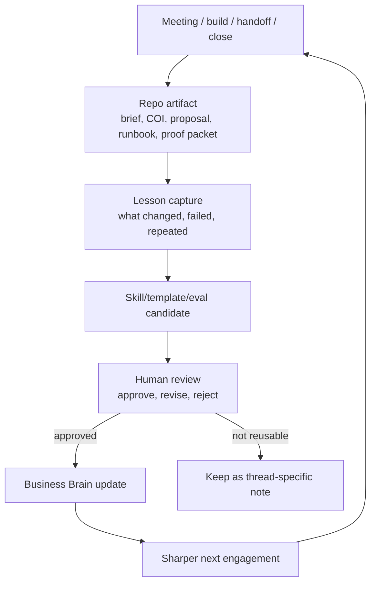

# Diagram: Compounding Loop

```mermaid
flowchart TD
  Work["Meeting / build / handoff / close"]
  Artifact["Repo artifact\nbrief, COI, proposal, runbook, proof packet"]
  Lesson["Lesson capture\nwhat changed, failed, repeated"]
  Candidate["Skill/template/eval candidate"]
  Review["Human review\napprove, revise, reject"]
  Brain["Business Brain update"]
  Next["Sharper next engagement"]

  Work --> Artifact --> Lesson --> Candidate --> Review
  Review -->|"approved"| Brain --> Next --> Work
  Review -->|"not reusable"| Archive["Keep as thread-specific note"]
```

## Notes

- No self-rewriting skills.
- No client-confidential backflow.
- Eval fixtures come from real misses and repeated patterns.
