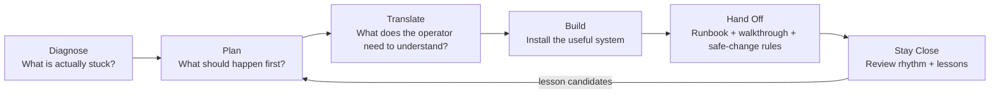

# Diagram: Operator Flow

## Notes

- Use the plain six-step method for operator-facing work.
- The shorter public phrase can be "Diagnose, Install, Operate" when simplicity
  matters.
- Handoff is not a final document; it is the proof that the system works.
