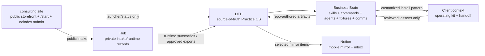

# Diagram: Business Brain System Architecture

## Notes

- DTP is source of truth.
- Hub is runtime support.
- Notion is a mirror and phone inbox.
- Client installs do not become multi-tenant SaaS.
- Lessons flow back only after review and redaction.
